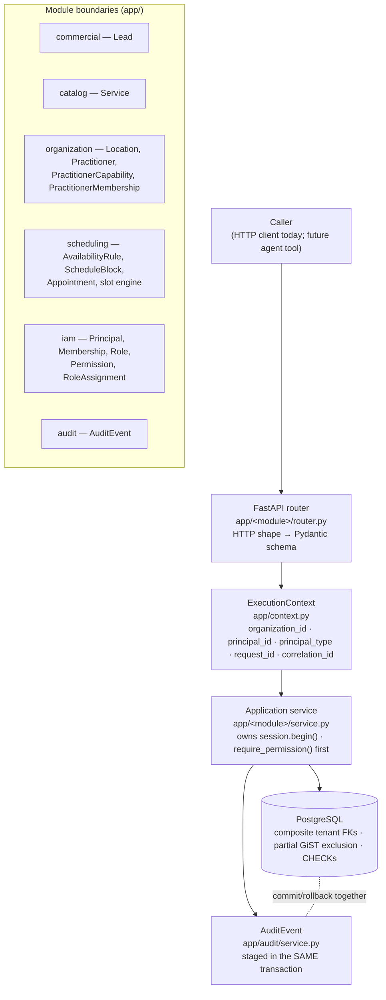

# Architecture

This document describes the architecture **implemented in `HEAD` today**, at a five-minute-read altitude. It
does not describe PF4 or any later vertical — those are roadmap items (see [`roadmap.md`](roadmap.md)). For
the detailed technical authority — the full Lead→Appointment lifecycle, why each PF1–PF4 block exists and in
that order, and the MediStock migration map — see
[`backend-platform-blueprint.md`](backend-platform-blueprint.md).

---

## 1. Shape of the system

OdontoFlow is a **Python/FastAPI modular monolith** backed by **PostgreSQL 15**. One deployable process, one
database, six explicit module boundaries under `app/`. There is no message queue, no cache tier, no async
runtime migration, and no LLM library imported anywhere in `app/` — deterministic rules live in code and in
PostgreSQL constraints, never in a model call.



The end-to-end sequence (identity → context → permission → mutation → audit → commit) is frozen in
`docs/superpowers/specs/2026-08-14-platform-foundation-design.md` §13 and is the authoritative version of
this diagram if the two ever disagree.

---

## 2. Module boundaries

| Module | Owns | Notes |
|---|---|---|
| `app/commercial` | `Lead` | pre-clinical commercial identity; not a `Patient` |
| `app/catalog` | `Service` | canonical services; `duration_minutes` is the **only** source of appointment duration |
| `app/organization` | `Organization`, `Location`, `Practitioner`, `PractitionerCapability`, `PractitionerMembership` | tenant root + branch + global professional identity |
| `app/scheduling` | `AvailabilityRule`, `ScheduleBlock`, `Appointment`, the slot engine, booking/cancel/reschedule | `availability.py` is pure stdlib logic — no DB, no FastAPI import |
| `app/iam` | `Principal`, `Membership`, `Permission`, `Role`, `RolePermission`, `RoleAssignment`, `ExecutionContext` | permission-based authorization |
| `app/audit` | `AuditEvent` | append-only, no FKs into domain tables, polymorphic `entity_id` |
| `app/idempotency` | `CommandReceipt` + `run_idempotent_command` | PF4: claim-first exactly-once for mutations, replay of stored outcomes |
| `app/clinical` | `Patient`, `Visit`, `ServiceExecution` | PF5: org-owned patients, attended encounters, executed services with price snapshot |

`app/context.py` (HTTP context adapter), `app/tenancy.py` (pre-PF3 bootstrap-organization seam, now superseded
by `ExecutionContext` for booking/cancel/reschedule but still the fallback), `app/db.py` (engine/session),
and `app/errors.py` (stable error envelope) are cross-cutting, not domain modules.

---

## 3. PostgreSQL as authority

Three invariant classes are enforced by the database, not by application code alone:

**Tenant integrity.** `Organization` is the tenant root. Every tenant-owned table carries `organization_id`
directly (never derived through a join), and every child that references another tenant-owned parent does so
through a **composite foreign key** into that parent's `UNIQUE (organization_id, id)`:

```sql
ALTER TABLE appointments
  ADD CONSTRAINT fk_appointments_organization_service
  FOREIGN KEY (organization_id, service_id) REFERENCES services (organization_id, id)
  ON DELETE RESTRICT;
```

Because `organization_id` appears in both the child's own tenant column and the referencing tuple, a row
mixing tenants (e.g. `Appointment(org=A)` pointing at `Service(org=B)`) is rejected by PostgreSQL even if
every application check is bypassed. This is implemented for `locations`, `services`, `leads`,
`practitioner_capabilities`, `availability_rules`, `schedule_blocks`, `appointments`, `memberships`, `roles`,
and `role_assignments` (migrations `0002`, `0003`).

**The global practitioner / scheduling invariant.** `Practitioner` is deliberately **not** tenant-owned — a
professional may hold memberships in several organizations (`PractitionerMembership`). Overlap protection is
a partial GiST exclusion constraint that is **practitioner-global**, on purpose:

```sql
EXCLUDE USING gist (practitioner_id WITH =, tstzrange(start_utc, end_utc, '[)') WITH &&)
  WHERE (state = 'confirmed')
```

A practitioner cannot physically be in two chairs at once, in any organization — so `organization_id` is
never added to this key, and the overlap **preflight** query (`app/scheduling/query.py`) is deliberately kept
practitioner-global too, so it never offers a slot the constraint would then reject. A cross-organization
clash surfaces as the same stable `409` the caller already knows (`SLOT_BLOCKED` at preflight, or
`APPOINTMENT_CONFLICT`/`23P01` if preflight is bypassed) and leaks no data about the other organization's
appointment.

**Value-domain rules.** `duration_minutes > 0`, appointment `state ∈ {confirmed, cancelled}`, principal
`type ∈ {human, agent, integration, system}`, `UNIQUE(organization_id, name)` on services, etc. — plain
CHECK/UNIQUE constraints, listed in the migrations under `alembic/versions/`.

---

## 4. Transaction ownership and audit atomicity

`book_appointment`, `cancel_appointment`, and `reschedule_appointment` (`app/scheduling/service.py`) each own
one explicit transaction via `session.begin()`, called on an idle `Session` **before any read**. Routers never
open a transaction and never query before calling the service. `record_event` (`app/audit/service.py`) stages
an `AuditEvent` row inside that same open transaction — it never commits and never opens its own — so a
mutation and its audit row land together or not at all. This is proven by tests asserting exactly one audit
row per successful booking and zero on any failure path.

---

## 5. Principal / permission model

`Principal` is a global identity (`type ∈ human | agent | integration | system`), reaching a tenant only
through a `Membership` row. Authorization is **permission-based**, never role-name based:

```sql
SELECT 1
  FROM memberships m
  JOIN role_assignments ra ON ra.membership_id = m.id
  JOIN role_permissions rp ON rp.role_id       = ra.role_id
  JOIN permissions p       ON p.id             = rp.permission_id
 WHERE m.organization_id = :organization_id
   AND m.principal_id    = :principal_id
   AND m.is_active
   AND p.code            = :code
   AND (ra.location_id IS NULL OR ra.location_id = :location_id)
 LIMIT 1;
```

`role_assignments.location_id` is `NULL` for an organization-wide grant, or a concrete `Location` for a
branch-scoped one. The evaluation is live (nothing cached in `ExecutionContext`), deny-by-default, and never
branches on `principal_type` — a human and an agent holding the same grant are authorized identically, with
different auditable provenance. Application code never contains `if role == "owner"`-style logic; services
ask for a permission code (`appointments.create`, `services.manage`, …), and roles are tenant-editable data.

---

## 6. ExecutionContext and audit provenance

`ExecutionContext` (`app/iam/context.py`) is a frozen, explicit value object — **not** a `ContextVar` or
thread-local — carrying `organization_id`, `principal_id`, `principal_type`, `request_id`, `correlation_id`.
Transports (today: the HTTP router, via `app/context.py`) construct it once per request; application services
take it as an explicit parameter. `AuditEvent` rows derive their provenance from the context, so a completed
mutation answers: which organization, which principal, what kind of actor, which request, which end-to-end
correlation, and what changed (before/after JSONB).

---

## 7. Deterministic API boundary

Every mutating schema uses `extra="forbid"`: a caller can never smuggle `duration`, `end`, or `state` — those
are computed from `Service.duration_minutes` and the domain rules, never accepted as input. Every response
declares a `response_model`; no raw ORM object is ever serialized directly. Every error uses one stable
envelope, `{"error": {"code", "message", "details"}}`, and never leaks SQL, constraint names, SQLSTATE values,
or stack traces. The full HTTP contract is generated from the running app into
`docs/api/openapi.yaml` / `docs/api/openapi.json`. **Note:** at the time of writing these files (and
`AGENTS.md`) exist in the working tree but are not committed to git — see the GitHub hygiene note in
`docs/superpowers/handoffs/2026-08-14-github-repository-consolidation-handoff.md`.

---

## 8. Absence of LLM dependencies from the core

No module under `app/` imports an LLM SDK, an agent framework, or a vector store. `app/scheduling/availability.py`
is stdlib-only. Deterministic rules — duration, capability, availability, overlap, state transitions,
authorization — are enforced by application code and PostgreSQL constraints. This is a **design invariant**,
not a current-scope accident: see [`product-vision.md`](product-vision.md) for why it is expected to hold even
as agents become callers of this API.

---

## 9. Verified gaps — what is *not* yet true, even though PF1–PF3 are closed

PF1 (tenant integrity), PF2 (permission-based IAM), and PF3 (ExecutionContext + audit provenance) are closed —
see [`backend-evolution.md`](backend-evolution.md) — but "closed" describes the platform-foundation work
package, not blanket production-readiness. Four gaps are already identified in the repository's own design
record (`docs/superpowers/specs/2026-08-14-backend-documentation-design.md`) and remain true at `HEAD`:

1. **No authentication exists.** Every HTTP request currently resolves to the seeded `system` principal in
   the bootstrap organization (`app/context.py`'s `default_context`). This is a development compatibility
   boundary, not a production identity mechanism — PF0's BLOCKER-1 records the intended trusted-adapter design
   that would replace it.
2. **`create_organization` does not call `provision_system_access`.** The function that would atomically grant
   a newly created organization its `system` membership and role assignment exists (PF2), but nothing wires it
   into organization creation yet — a new organization has no system access until something calls it manually.
3. **PF3 wiring is scoped to appointment booking, cancellation, and rescheduling.** Explicit `ExecutionContext`
   construction and live permission enforcement are wired at the HTTP boundary for those three operations only;
   the remaining tenant-scoped reads and writes (leads, catalog, organization, availability) still use the
   pre-PF3 transport path (`app/tenancy.py`'s bootstrap seam), not `require_permission`.
4. **Appointment services retain a `ctx: ExecutionContext | None = None` compatibility path.** A direct caller
   that omits `ctx` resolves a default context and skips the explicit permission guard. This exists for test
   compatibility, not as an authorization boundary — it is not reachable from the current HTTP surface, but it
   is a real gap if a new caller is added carelessly.

Treat these as the honest state of platform hardening before Clinical Bridge work starts, not as defects to
silently patch while writing documentation.
