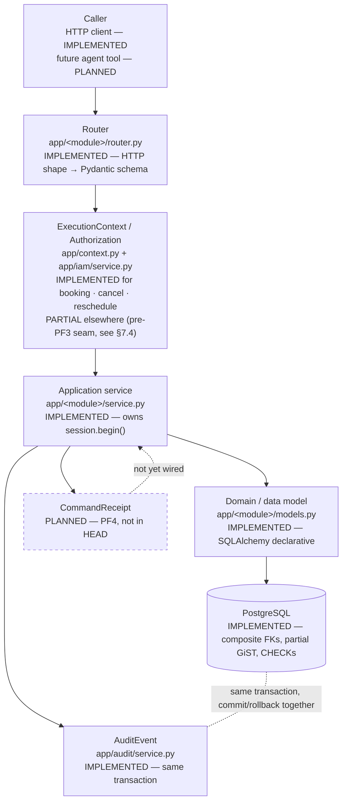

# Backend Platform Blueprint

This is the **detailed technical authority** for the OdontoFlow backend — deeper than
[`architecture.md`](architecture.md), which stays a five-minute current-state summary. Where the two
overlap, this document is the one to trust for depth; where either cites a spec, test, or handoff under
`docs/superpowers/`, that source file is the actual authority for the exact contract.

Every claim below is grounded in `app/`, `alembic/versions/`, `tests/`, and the handoffs in
`docs/superpowers/handoffs/` at `HEAD`. Nothing here is inferred from the roadmap.

---

## 1. Current purpose

OdontoFlow is a **multi-tenant operational ERP** for dental clinics, designed so that humans, agents,
integrations, and system processes all operate over the **same deterministic business state** — the same
tables, the same constraints, the same authorization rules, the same audit trail. Today that state covers one
vertical end to end: a commercial `Lead` becomes a confirmed, conflict-free `Appointment`. Everything below
describes how that vertical is built and what platform machinery (`Organization`, `Principal`,
`ExecutionContext`) already exists underneath it for the verticals that come next.

---

## 2. Architectural principles, and why each exists

| Principle | What it means in this codebase | Why it exists |
|---|---|---|
| **FastAPI modular monolith** | One deployable process; six explicit module boundaries under `app/` (`commercial`, `catalog`, `organization`, `scheduling`, `iam`, `audit`); no service mesh, no message queue. | A clinic ERP's modules (leads, catalog, scheduling, IAM) share one transactional truth constantly — an appointment touches catalog, organization, and audit in the same commit. Splitting that into network-separated services would trade transactional integrity for an operational complexity this product doesn't need yet. Module boundaries are enforced by Python package structure and code review, not a network hop, which is the cheapest form of boundary that still prevents modules from silently reaching into each other's tables. |
| **PostgreSQL as transactional authority** | Overlap conflicts, tenant integrity, and value-domain rules are PostgreSQL constraints (CHECK, UNIQUE, composite FK, partial GiST exclusion), not application-only validation. | Application code can be bypassed by a bug, a bad migration, a direct psql session, or a future caller nobody reviewed. A constraint cannot be "forgotten" in a new code path the way an `if` check can. This is the single idea PF0–PF3 build everything else around. |
| **SQLAlchemy + Alembic** | Declarative typed models (`Mapped[...]`), one linear migration history (`0001` → `0002` → `0003`), every migration additive and reversible. | A modular monolith needs one schema evolution story that every module's models participate in; Alembic gives that without inventing a bespoke migration runner. Additive-only migrations mean Vertical 1 data survives every later platform change — proven by the PF1/PF2 migration-cycle tests (upgrade → downgrade → re-upgrade with rows intact). |
| **Organization = tenant** | `Organization` is the tenant root and the security boundary; every tenant-owned table carries `organization_id` directly. | The gate report behind PF0 (`docs/superpowers/handoffs/2026-08-13-platform-readiness-evidence.md`) identified *derived* tenant ownership (inferring which org a `Lead` or `AuditEvent` belongs to via a join) as unrecoverable once ambiguous — a never-booked lead has no derivable organization. Direct ownership removes the category of problem instead of mitigating it. |
| **Location = branch** | `Location` belongs to exactly one `Organization`; it is a scope *inside* a tenant, never the tenant itself. | A clinic group has several physical branches; permissions, availability, and scheduling all need to reason at a finer grain than "the whole company," but that grain must still resolve back to one tenant unambiguously. |
| **Explicit business services** | `app/<module>/service.py` functions take explicit arguments (a `Session`, entity ids, and — since PF3 — an `ExecutionContext`); no service reads implicit request state. | The same function must be callable identically from an HTTP router, a future agent tool, or a test — with no framework object smuggled in. This is what makes "an agent calls the same deterministic service a human does" true rather than aspirational. |
| **Database-enforced tenant integrity** | Composite foreign keys — e.g. `appointments (organization_id, service_id) → services (organization_id, id)` — make a cross-tenant row a PostgreSQL rejection. | See §5 for the full mechanism; the short version is that "the application always checks this" is a much weaker guarantee than "the database physically cannot store this." |
| **Global Practitioner identity** | `Practitioner` carries no `organization_id`; it reaches a tenant only through `PractitionerMembership`. | A dentist can work at two clinic groups. Forcing a practitioner into one tenant would either duplicate the person (breaking "this is the same physical human, can't double-book them") or misrepresent multi-clinic reality. Global identity + membership rows keeps both true at once (§6). |
| **Permission-based authorization** | Authorization asks "does this `Principal` hold permission code X, in this scope" — never "is this role named 'owner'". | Role names are tenant-editable data (a clinic can rename or restructure its own roles); a hardcoded role-name check would silently break the moment a tenant renamed a role. A permission code is the only thing services should ever depend on (§7). |
| **Explicit ExecutionContext** | `organization_id`, `principal_id`, `principal_type`, `request_id`, `correlation_id` are passed as one frozen value object into every service that needs them — never read from a `ContextVar`, thread-local, or ambient request global. | Ambient state makes the domain layer secretly depend on which transport happens to be running (HTTP today, an agent tool tomorrow). An explicit parameter has no such dependency — a test, an agent, and an HTTP request all look identical to the service (§8). |
| **Atomic AuditEvent provenance** | `record_event` stages an `AuditEvent` row inside the *same* open transaction as the mutation it describes; it never commits on its own and is never deferred to a background task. | An audit row that can silently fail to land, or land without the mutation it describes, is worse than no audit at all — it creates false confidence. Atomicity is the only way "there is one audit row per successful mutation, zero on failure" can be a provable invariant instead of a best-effort one. |
| **Application-owned transactions** | `book_appointment`, `cancel_appointment`, `reschedule_appointment` each call `session.begin()` themselves, on an idle session, before any read. No middleware, dependency, or decorator opens a transaction on their behalf. | Transaction boundaries that live in middleware are invisible at the call site and easy to violate accidentally (a "helper" that queries before the real transaction opens). Owning the transaction inside the function that has the whole business operation in view keeps the boundary auditable by reading one function. |
| **Deterministic scheduling** | Slot generation (`app/scheduling/availability.py`) is pure stdlib code: no DB session, no FastAPI import, 15-minute grid, half-open `[start, end)` intervals, in the location's IANA timezone. Final conflict arbitration is a PostgreSQL partial GiST exclusion, not a re-check in Python. | A slot engine that can be called with no side effects is trivially testable and trivially reusable by a future agent tool without dragging in a request context. Making PostgreSQL the *final* word on overlap (not just the preflight) means even a buggy preflight can never corrupt the schedule — the worst case is a clean, already-defined error response. |
| **Agents never write PostgreSQL directly** | No module under `app/` imports an LLM SDK, agent framework, or vector store. Every path to a mutation goes through the same application service and the same constraints, regardless of caller. | This is the load-bearing promise of the whole platform: an agent can propose, plan, and call tools, but it is a `Principal` subject to the exact same permission check and the exact same PostgreSQL constraints as a human. There is no code path where a model's output is trusted to be a valid business state. |

---

## 3. Current module architecture



| Module | Owns | Status |
|---|---|---|
| `app/commercial` | `Lead` | IMPLEMENTED |
| `app/catalog` | `Service` (canonical duration) | IMPLEMENTED |
| `app/organization` | `Organization`, `Location`, `Practitioner`, `PractitionerCapability`, `PractitionerMembership` | IMPLEMENTED |
| `app/scheduling` | `AvailabilityRule`, `ScheduleBlock`, `Appointment`, the slot engine, booking/cancel/reschedule | IMPLEMENTED |
| `app/iam` | `Principal`, `Membership`, `Permission`, `Role`, `RolePermission`, `RoleAssignment`, `ExecutionContext` type | IMPLEMENTED |
| `app/audit` | `AuditEvent` | IMPLEMENTED |
| `app/context.py` | HTTP → `ExecutionContext` adapter | IMPLEMENTED for 3 endpoints (§7.4) |
| `app/tenancy.py` | Pre-PF3 bootstrap-organization seam | IMPLEMENTED, now a fallback |
| `CommandReceipt` / idempotent commands | — | PLANNED (PF4) |
| Clinical, Finance, Inventory modules | — | PLANNED (see §9, §10) |

---

## 4. The Lead → Appointment vertical, walked end to end

This is Vertical 1, closed at `4086dc1`. Full design authority:
`docs/superpowers/specs/2026-08-12-lead-to-appointment-design.md`. Full closure proof:
`docs/superpowers/handoffs/2026-08-13-task-10-lead-to-appointment-e2e-handoff.md`. This section explains the
*lifecycle*, not the HTTP contract (see `docs/api/openapi.yaml` for that) or every test (see `tests/`).

```
Lead ──service_need──► Service (canonical duration)
                              │
Practitioner ──membership──► PractitionerCapability (practitioner × service × location)
                              │
Location ──availability──► AvailabilityRule / ScheduleBlock
                              │
                          Slot query (pure, deterministic)
                              │
                          Appointment (confirmed)
                              │
                  ┌───────────┴───────────┐
              Reschedule                Cancel
          (same row, new interval)   (state → cancelled)
```

1. **`Lead`** (`app/commercial`) is registered with an acquisition source (`promotion | referral | direct`)
   and an optional `service_need`. A Lead is explicitly **not** a `Patient` — no clinical relationship exists
   yet, which is exactly why the future Clinical Bridge (§9) introduces a real `Patient` rather than promoting
   a Lead into one.
2. **`Service`** (`app/catalog`) is the canonical catalog entry. `duration_minutes` is the **only** source of
   an appointment's duration anywhere in the system — every mutating schema uses `extra="forbid"`, so a
   caller can never submit a `duration` or `end` and have it accepted.
3. **`PractitionerCapability`** (`app/organization`) is the explicit grant that a practitioner may perform a
   given service at a given location. It is a triple `(practitioner, service, location)`, DB-unique, and
   tenant-consistent by composite FK (a capability cannot mix resources from two organizations).
4. **`Location`** owns its own IANA timezone (`America/Lima`, `Europe/Madrid`, …), validated against Python's
   `zoneinfo`. Every wall-clock decision (availability windows, the slot grid) happens in that timezone;
   every persisted instant (`start_utc`, `end_utc`) is UTC.
5. **Availability** is two inputs: `AvailabilityRule` (a recurring weekly window, `day_of_week` +
   `start_local`/`end_local`) and `ScheduleBlock` (an exceptional closed interval — vacation, a blocked
   afternoon). Both are tenant- and location-scoped.
6. **Slot query** (`app/scheduling/availability.py` + `app/scheduling/query.py`) is pure, deterministic logic:
   candidate start times are aligned to a **15-minute grid** in the location's timezone; a candidate survives
   only if the **whole** `[start, end)` interval (duration from step 2) fits inside a recurring availability
   window and intersects **neither** a schedule block **nor** an existing confirmed appointment. The
   conflicting-appointment read here is deliberately **practitioner-global**, not tenant-scoped — see §5 for
   why that must exactly mirror the database constraint.
7. **`Appointment`** — booking (`app/scheduling/service.py::book_appointment`) opens one transaction,
   re-validates everything live inside it (lead/service/location/practitioner exist and are active,
   capability is active, the slot is still open), computes `end = start + Service.duration_minutes`, inserts
   the row, and relies on PostgreSQL's partial GiST exclusion as the final concurrency authority — not a
   second Python re-check. Two callers can both pass preflight; PostgreSQL lets exactly one commit.
8. **Reschedule** (`reschedule_appointment`) takes the row `FOR UPDATE` first (serializing concurrent
   mutations of the same appointment), updates the **same row** to a new interval — it is excluded from its
   own conflict check by identity, not by a time-window heuristic — and writes one audit record carrying both
   the old and new interval.
9. **Cancel** (`cancel_appointment`) also takes `FOR UPDATE` first, flips `state` to `cancelled` (a cancelled
   row never blocks the GiST exclusion again, freeing the interval for reuse), and writes one audit record.
10. **Audit**, at every step: exactly one `AuditEvent` per successful mutation, in the same transaction, with
    before/after JSONB (`{id, start_utc, end_utc, state}`), and — since PF3 — real provenance instead of a
    hardcoded `"system"` actor (§8).

**Concurrency, precisely.** The database invariant is a partial GiST exclusion constraint:

```sql
EXCLUDE USING gist (practitioner_id WITH =, tstzrange(start_utc, end_utc, '[)') WITH &&)
  WHERE (state = 'confirmed')
```

Two confirmed appointments for the same practitioner can never overlap — across *any* organization, on
purpose (§5). A booking race that both pass preflight resolves to exactly one `201` and one `409
APPOINTMENT_CONFLICT` (SQLSTATE `23P01`). A genuine deadlock (`40P01`) during booking gets exactly one
transport-level retry; a second `40P01` returns the same stable conflict. Cancel and reschedule are excluded
from that retry policy because they already serialize through `FOR UPDATE`.

**Full behavioral detail, tests, and edge cases** (deadlock retry policy derivation, exact response shapes,
audit payload shapes) live in `docs/superpowers/specs/2026-08-12-lead-to-appointment-design.md` and
`tests/test_booking.py`, `tests/test_booking_invariant.py`, `tests/test_cancellation.py`,
`tests/test_rescheduling.py`, `tests/test_lead_to_appointment_e2e.py` — not duplicated here.

---

## 5. Why PostgreSQL, not application code, owns tenant integrity

For every tenant-owned child `C` referencing tenant-owned parent `P`:

```sql
ALTER TABLE p ADD CONSTRAINT uq_p_org_id UNIQUE (organization_id, id);

ALTER TABLE c
  ADD CONSTRAINT fk_c_p_tenant
  FOREIGN KEY (organization_id, p_id) REFERENCES p (organization_id, id)
  ON DELETE RESTRICT;
```

Because `organization_id` appears in both the child's own tenant column and the referencing tuple, the
child's tenant and the parent's tenant are the *same value by construction* — no trigger, no application
check, no row-level-security policy is involved. This is implemented (migration `0002`) for `locations`,
`services`, `leads`, `practitioner_capabilities`, `availability_rules`, `schedule_blocks`, `appointments`, and
(migration `0003`) for `memberships`, `roles`, `role_assignments`.

**The one deliberate exception:** the practitioner-overlap GiST exclusion never gets `organization_id` added
to its key. A practitioner cannot physically be in two chairs at once, in any organization — multi-tenancy is
a visibility and authority boundary, not a licence to violate physics. The overlap **preflight** query
(`app/scheduling/query.py`) is therefore kept practitioner-global on purpose, so it can never offer a slot the
constraint would then reject — a cross-organization clash surfaces as the same clean `409` a same-tenant
clash would, and leaks nothing about the other organization's appointment (`details == {}` in the error
envelope, verified over HTTP).

---

## 6. Global Practitioner / multi-organization model

`Practitioner` is a global identity row: stable id, `display_name`, `is_active`. It never gains an
`organization_id`. Instead, `PractitionerMembership` is the row that says "this practitioner works for this
organization," and every scheduling row that names a practitioner (`PractitionerCapability`,
`AvailabilityRule`, `ScheduleBlock`, `Appointment`) references the **membership**, not the bare practitioner,
via the composite FK `(organization_id, practitioner_id) → practitioner_memberships(organization_id,
practitioner_id)`. A practitioner who does not work for an organization cannot appear in that organization's
schedule — enforced by PostgreSQL, not an application check.

Two independent activity flags exist on purpose: `practitioners.is_active` is a platform-wide kill switch;
`practitioner_memberships.is_active` means "currently works for *this* organization." Booking eligibility
requires both. Deactivating a membership removes eligibility in that organization only; membership rows are
never deleted (offboarding is `is_active = false`), so historical appointments stay attributable.

---

## 7. Principal, permission, and execution-context model

### 7.1 Principal

`Principal` (`app/iam/models.py`) is a global identity with a closed type set —
`human | agent | integration | system`, enforced by a CHECK constraint — reaching a tenant only through a
`Membership` row, exactly like `Practitioner`. `principal_type` is always read from the database row that
identity resolution found; it is never accepted from a request header, body field, or tool argument, which is
the structural defence against an agent presenting itself as a human.

### 7.2 Authorization

Authorization is one live SQL evaluation, never cached and never precomputed:

```sql
SELECT 1
  FROM memberships m
  JOIN role_assignments ra ON ra.membership_id = m.id
  JOIN role_permissions rp ON rp.role_id       = ra.role_id
  JOIN permissions p       ON p.id             = rp.permission_id
 WHERE m.organization_id = :organization_id
   AND m.principal_id    = :principal_id
   AND m.is_active
   AND p.code            = :code
   AND (ra.location_id IS NULL OR ra.location_id = :location_id)
 LIMIT 1;
```

`role_assignments.location_id` is `NULL` for an organization-wide grant or a concrete `Location` for a
branch-scoped one — a concrete nullable foreign key, not a polymorphic `scope_type`/`scope_id` pair, because
only a concrete FK is something PostgreSQL can check. Deny-by-default: no matching row is a denial, and denial
never varies by which condition failed (a caller lacking permission never learns whether the entity exists).
`app/iam/service.py::require_permission` is the single entry point; application code never branches on
`principal_type` or on a role's name/code — tests parse `app/` with `ast` to enforce that no such string
literal exists in a decision path.

### 7.3 ExecutionContext

```python
@dataclass(frozen=True, slots=True)
class ExecutionContext:
    organization_id: int
    principal_id: int
    principal_type: str        # read from the DB, never from a caller
    request_id: str
    correlation_id: str
```

Explicit, immutable, and carries **no authority** — no permission set, no role list, no `is_admin` flag.
Authority is always evaluated live against the database (§7.2), so revoking a membership takes effect on the
very next command with nothing to invalidate. Transports (today: the HTTP router, via `app/context.py`)
construct one context per request; application services take it as a parameter.

### 7.4 What is wired today, precisely

`ExecutionContext` construction and live `require_permission` enforcement are wired at the HTTP boundary for
**booking, cancellation, and rescheduling only**. Every other tenant-scoped read and write (leads, catalog,
organization, availability configuration) still resolves through the pre-PF3 bootstrap-organization seam in
`app/tenancy.py`, not through `require_permission`. No authentication exists: every HTTP request resolves to
the seeded `system` principal in the bootstrap organization (`app/context.py`'s `default_context`) — a
development compatibility boundary, not a production identity mechanism. Application services also retain a
`ctx: ExecutionContext | None = None` compatibility path for direct (non-HTTP) callers that omit it, which
resolves a default context and skips the explicit permission guard — real for test compatibility, not an
authorization boundary. These four facts are the honest current state, not defects introduced by this
document; they are recorded in the repository's own design record
(`docs/superpowers/specs/2026-08-14-backend-documentation-design.md`) and are the concrete work items under
"Platform Foundation gap closure" in [`roadmap.md`](roadmap.md).

---

## 8. Audit provenance

`record_event` (`app/audit/service.py`) stages one `AuditEvent` row inside the caller's already-open
transaction — never its own commit, never a background task. Since PF3, provenance is derived from the
resolved `ExecutionContext` rather than defaulting to `"system"`/`NULL`: `organization_id`, `principal_id`,
`principal_type`, and `correlation_id` (the `X-Correlation-Id` header when present, else derived from
`request_id`) all land on the row. A human and an agent performing the same allowed operation therefore
produce **identical business behavior** with **different auditable provenance** — which is the concrete,
testable meaning of "agent-native, without giving agents special authority."

---

## 9. Platform Foundation — PF1 through PF4

PF0 (`docs/superpowers/specs/2026-08-14-platform-foundation-design.md`) is the frozen design authority all
four blocks implement against. Each PFn handoff under `docs/superpowers/handoffs/` is the authoritative
delivery record; this section explains *why the sequence matters*, not the schema (already in §5–§8).

| Block | Delivers | Commit | Why it has to come before what's next |
|---|---|---|---|
| **PF1** — Organization & tenant integrity | `Organization` as tenant root; composite tenant FKs; `PractitionerMembership` | `4ff2de5` | Nothing about "which agent may act for which clinic" is answerable until rows *belong* to a tenant unambiguously. Identity and authorization would otherwise have no scope to attach to. |
| **PF2** — Principal & authorization | `Principal`, `Membership`, `Role`, `Permission`, `RoleAssignment`; live deny-by-default evaluation | `44ba874` | Once tenancy exists, the next question is "who may act, and with what authority" — decoupled from *how* they're identified (that's PF3) so the permission model doesn't get built around one transport's assumptions. |
| **PF3** — ExecutionContext & audit provenance | Explicit context wired into booking/cancel/reschedule; real audit provenance | `1a737b0` | Authorization needs to know *which* principal and *which* organization are acting on *this* request — that binding is the transport's job, and it has to be explicit so an agent tool can construct the same context an HTTP request does. |
| **PF4** — Idempotent commands | `CommandReceipt` (durable PostgreSQL, no Redis), exactly-once semantics for booking/cancel/reschedule | *(not started — no migration `0004`, no `command_receipts` table exists at `HEAD`)* | Agents and integrations retry on timeout far more often and far more mechanically than a human clicking a button twice. Idempotency has to exist *before* agents are trusted as regular callers, or a retried booking becomes a double-booked (or double-billed, later) clinic. This is why PF4 is next, not Clinical Bridge. |

**Why this order makes the future platform safe for every kind of caller.** A human, an agent, an
integration, and a system job are all, structurally, just `Principal` rows of different `type`. Because
authorization (PF2) evaluates the same query regardless of `principal_type`, and because `ExecutionContext`
(PF3) is constructed identically by any transport, there is no code path where "the caller is an agent" grants
more — or less — than what its membership and role assignments say. **PF4 closes the remaining gap that
matters specifically for automated callers**: without idempotency, a network retry from an agent's tool-call
loop can duplicate a mutation that a human, hesitating before clicking again, mostly wouldn't. None of this
gives an LLM business authority — an agent's only inputs to a decision are its `Principal` row and the org's
membership/role data, the same inputs a human has; the model's own output is never read by a permission check
or a domain rule.

---

## 10. MediStock migration map

**The rule:** migrate domain behavior and invariants that were proven to matter — not Flask endpoints,
Marshmallow schemas, or any other legacy framework decision. MediStock is the *donor of domain knowledge*
(what a dental clinic's operations actually need to track), never a codebase OdontoFlow edits or a target
architecture to reproduce. `../../medistock` remains read-only; this map is the result of a targeted, read-only
inspection of exactly the domain concepts requested — `src/clinica_backend/app/models/*.py`,
`app/services/*.py`, and `src/sql/migrations/*.sql` — not a broad audit of the legacy repository.

| MediStock concept | OdontoFlow target | Classification | What's actually worth carrying over |
|---|---|---|---|
| `Paciente` (`models/paciente.py`) | **Patient** (Clinical Bridge) | **ADAPT** | Direct demographic identity (DNI-unique, name, phone, partial birthdate with computed age, a `distrito`/district FK) is a reasonable starting shape. What must change: it must become **organization-owned directly** (PF0 P10 — a future `Patient` must be organization-scoped before Clinical Bridge starts), not global like MediStock's single-tenant `pacientes` table; and `alertas`/`paciente_problematico` (ad hoc "missing data" flags, a boolean "problematic patient" flag with no defined workflow) are presentation-layer conveniences, not invariants worth preserving as-is. |
| `Servicio` / `ServicioCatalogo` (`models/servicio.py`, `models/servicio_catalogo.py`) | **Service** (already implemented, `app/catalog`) | **REFERENCE** (already done, differently) | Both MediStock classes map to the **same table** (`servicios_catalogo`) — a duplicate/legacy-artifact model pair, evidence of exactly the un-curated catalog drift OdontoFlow's single canonical `Service` (§10 principle: "the same canonical Service connects Scheduling, Clinical, Finance, Operations — no duplicate catalogs") is designed to prevent structurally. OdontoFlow's `Service.duration_minutes` (the authoritative scheduling input) has no equivalent in MediStock at all — MediStock's `Servicio` only carries a price, because MediStock never scheduled anything. Nothing to port; the lesson is architectural, not code-level. |
| `Consulta` (`models/consulta.py`) | **Visit** (Clinical Bridge) | **ADAPT** | A `Consulta` ties one patient, a date, notes, and a computed running total to a set of services performed — structurally close to what a `Visit` needs to anchor. Must gain organization/location ownership and a link back to the `Appointment` that produced it (MediStock has no scheduling concept upstream of a consultation at all — `Consulta` is created standalone). `total_historico` (a denormalized running total with no defined recomputation rule) should not be carried over as-is. |
| `ConsultaServicio` (`models/consulta_servicio.py`) | **ServiceExecution** | **ADAPT** | The join between a visit and a performed service, carrying its own snapshotted price (`precio_servicio`, captured at the time, not read live from the catalog) — this snapshot-at-time-of-execution pattern is worth keeping, since a later catalog price change must never rewrite history. Must reference the **same canonical `Service`** OdontoFlow already has (`app/catalog`), not a duplicate. |
| `Producto` (`models/producto.py`) | **Product** (Inventory/Operations) | **ADAPT, with a specific correction** | Brand-linked catalog entry (`costo_unitario`, `precio_venta`, unit of measure) is a reasonable shape. The specific thing **not** to carry over: `Producto.stock_actual` is a **mutable column directly on the catalog row** — see the Inventory finding below for why this is exactly the anti-pattern OdontoFlow's inventory design must avoid. |
| `ConsumoProducto` (`models/consumo_producto.py`) | **ServiceConsumption** | **ADAPT** | Correct shape conceptually — a service execution consumes a quantity of a product at a snapshotted sale price (`precio_producto`, `importe_venta`) — this is precisely `ServiceExecution → ServiceConsumption` in the target model (§11). The consumption record itself is sound; only its *side effect* on stock (below) needs to change. |
| **Inventory** (`models/inventario.py`: `MovimientoStock`; `services/inventario_service.py`; `sql/migrations/001-003`) | **InventoryMovement / InventoryBalance** | **ADAPT the ledger idea; DROP the mutable-mirror mechanism** | Detailed finding below — this is the concept that most needs a real fix, not a copy. |
| `Factura` (`models/factura.py`) | **Invoice** (Finance) | **ADAPT** | `total_bruto` → discount → `total_neto`, plus a computed `saldo_pendiente`/`esta_pagada` from summed payments, is a workable invoice shape. Must attach to a **`ServiceExecution`** (or a set of them), not directly to a `Consulta`/`Visit`, so a future partial-visit invoice or a multi-visit invoice isn't structurally blocked later. `total_historico` (undefined recomputation semantics, mirrored from `Consulta`) should not be carried over. |
| `Pago` (`models/pago.py`) | **Payment** | **ADAPT** | Simple append-style row against an invoice with a payment-method FK and amount — sound shape. `PagoService.eliminar_pago` allows hard-deleting a payment with no reversal/void record — that must become an explicit reversal, not a delete, to keep a financial ledger honest (the same lesson as the inventory finding, applied to money). |
| `MedioPago` (`models/medio_pago.py`) | **PaymentMethod** | **ADAPT** | A flat, named catalog (`nombre_m_pago` unique) — directly portable as a small platform/tenant catalog, no changes needed to the concept. |
| `Descuento` (`models/descuento.py`) | **PricingAdjustment / Discount** | **ADAPT, narrow the model** | MediStock's discount is a flat code + `tipo_descuento` (`PORCENTAJE`/fixed) + `valor`, applied **once, at the invoice level**. The concept (a named, typed, versionable pricing adjustment) is worth keeping; applying it only at the invoice — never at the individual service or product line — is a real limitation worth deciding about deliberately for OdontoFlow rather than inheriting silently. |

### Inventory — detailed finding (the concept the user asked to look at closely)

MediStock actually has **two independent, disagreeing mechanisms** claiming authority over how much stock a
product has, and this is the most concrete, evidence-backed argument for why OdontoFlow's inventory design
(already stated in `product-vision.md` as "ledger-based... never a direct mutable-stock decrement") must not
be a straight port:

1. **A real ledger exists.** `movimientos_stock` (`src/sql/migrations/001_stock_ledger_trigger.sql`) is an
   append-only Kardex: every row is `ENTRADA` or `SALIDA`, with a positive quantity, and — for consumption —
   a unique back-reference to the `consumo_productos` row that caused it. A PostgreSQL trigger
   (`trig_after_insert_consumo`) inserts the `SALIDA` row automatically whenever a `ConsumoProducto` is
   inserted. This part is a genuinely good pattern: an immutable, causally-linked movement history.
2. **A second trigger then denormalizes that ledger onto a mutable column**
   (`002_stock_ledger_sync.sql`): every insert/update/delete on `movimientos_stock` fires a recalculation of
   `productos_catalogo.stock_actual` by summing the entire ledger for that product. The comment in the
   migration is explicit about the intent: *"No actualizamos `stock_actual` en Python. Dejamos que el
   Trigger de DB lo haga."* ("We don't update `stock_actual` in Python. We let the DB trigger do it.")
3. **The application layer does not honor that intent.** `InventarioService.registrar_consumo`
   (`services/inventario_service.py`) — the actual path the API uses to record a product's use in a
   consultation — reads `producto.stock_actual`, checks it against the requested quantity in Python, inserts
   the `ConsumoProducto` row, **and also directly sets** `producto.stock_actual = stock_actual - cantidad`
   inside the same SQLAlchemy session, before committing. This means the mutable `stock_actual` column is
   written **twice** on every consumption — once by the DB trigger recalculating from the ledger, once by
   application code decrementing it directly — with the final committed value depending on statement/flush
   ordering inside one transaction, not on which one is "correct." Separately, `ajustar_stock` in the same
   service adjusts `stock_actual` **with no ledger entry at all**, bypassing the Kardex entirely for manual
   corrections — so a "manual stock adjustment" leaves no trace in the movement history that is supposed to
   be authoritative.

**What OdontoFlow's inventory design (Finance/Inventory vertical, still LATER on the roadmap) must therefore
guarantee, learned directly from this evidence:** the ledger (`InventoryMovement`) is the *only* thing an
application service ever writes; a derived `InventoryBalance` is either a read-time aggregate or a
trigger-maintained cache **with no independent, application-level writer** — never both a trigger and a
service method claiming the same column, and never a "manual adjustment" code path that skips the ledger.
Every stock change, including corrections, is a movement row with a reason, full stop. This is a direct,
evidence-based instance of the general principle already stated in [`product-vision.md`](product-vision.md):
"inventory is ledger based, and clinical consumption is tied to a real service execution" — this section is
the concrete legacy failure that principle is a response to.

### Legacy surfaces explicitly NOT intended for direct migration

- **Flask routes** (`src/clinica_backend/app/routes/*.py`) — HTTP shape is being redesigned from scratch as
  typed FastAPI contracts; the routes are not a contract to preserve.
- **Marshmallow schema implementation** (`src/clinica_backend/app/schemas/*.py`) — OdontoFlow already uses
  Pydantic v2 with `extra="forbid"`; there is nothing to port, only the validated *fields* are domain
  knowledge.
- **Streamlit UI** (`src/clinica_frontend/*`) — a different, non-adopted frontend technology; out of scope
  for a backend-documentation task and not an OdontoFlow target.
- **Legacy LangGraph agent orchestration** (`src/clinica_backend/app/agents/{graph,nodes,orchestrator,state,memory}.py`)
  — predates OdontoFlow's principal/permission/execution-context model entirely; any future agent integration
  is designed against PF1–PF4 (§9), not against this code.
- **Notebook runtime** (`notebooks/`) — exploratory, not a service boundary.
- **OLAP V1** (`src/jobs/{run_olap_cycle,setup_olap}.py`, `src/sql/olap/`) — a v1 analytics pipeline bolted
  onto the legacy schema; not migrated unless a future Intelligence/Optimization vertical (§12) specifically
  justifies reusing its approach.

None of the above was modified, and no broader audit of `../../medistock` was performed beyond the ten domain
concepts and the inventory mechanism named in this section.

---

## 11. Target ERP module map (FUTURE — not implemented)

See [`product-vision.md`](product-vision.md) for the bounded-context table, the target domain spine diagram,
operational-intelligence vision, and integration architecture — those are product-vision concerns. The one
architectural rule worth restating here because it directly constrains how Finance/Inventory must be built
when their time comes: **the same canonical `Service` row (`app/catalog`) must be the thing Scheduling,
Clinical, Finance, and Operations all reference. No vertical introduces its own service catalog.** MediStock's
own history (§10, `Servicio` vs `ServicioCatalogo`) is a concrete example of what happens when that
discipline slips.

---

## 12. Open technical debt this blueprint does not resolve

These are named, not fixed, per this task's scope (documentation only):

1. §7.4's four PF3 gaps (no authentication; `provision_system_access` not wired into `create_organization`;
   context/permission enforcement scoped to three endpoints; the `ctx=None` compatibility path).
2. PF0's BLOCKER-2 — `Lead` has no `location_id`, so a location-scoped principal cannot create one today.
3. PF4 (idempotent commands) has no code at `HEAD`.
4. The MediStock inventory double-write pattern (§10) is a legacy finding, not an OdontoFlow defect — flagged
   so it is designed *around*, not repeated, whenever the Inventory/Operations vertical starts.
