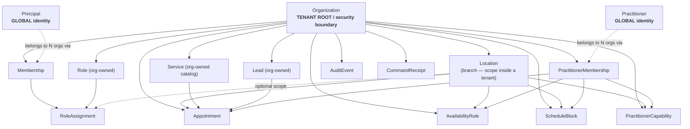
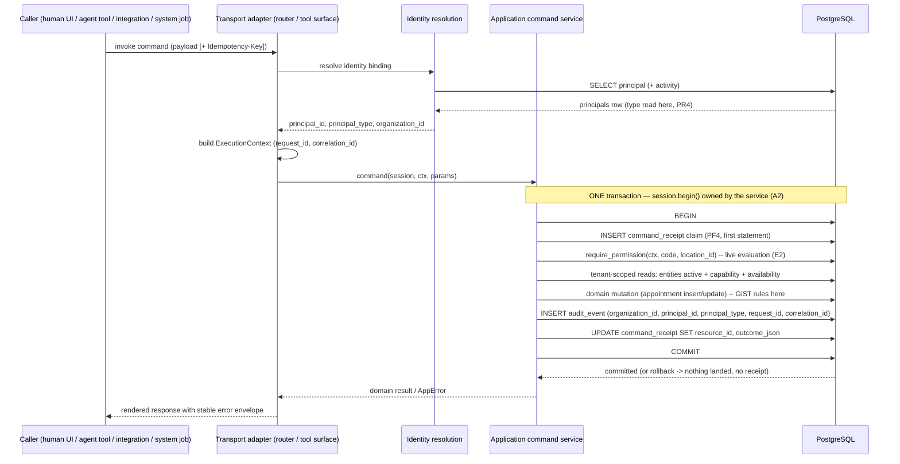

# PF0 — Platform Foundation Design Spec

**Date:** 2026-08-14 · **Baseline SHA:** `e5f3ba6` · **Suite:** 174 PASS · **Vertical 1:** CLOSED
**Nature:** ARCHITECTURE / SPECIFICATION. No production code, migration, test, config, or dependency is
changed by this document. It authorizes nothing by itself; it freezes the contracts that PF1–PF4 implement.

**Authoritative inputs:**

- `docs/superpowers/handoffs/2026-08-13-platform-readiness-evidence.md` (consolidated gate report)
- `docs/superpowers/evidence/platform-readiness-data-ownership.md` (Scout A — ownership/tenancy)
- `docs/superpowers/evidence/platform-readiness-actor-command.md` (Scout B — actors/API/idempotency/trace)
- `docs/superpowers/handoffs/2026-08-13-task-10-lead-to-appointment-e2e-handoff.md` (Vertical 1 closure)
- `docs/superpowers/specs/2026-08-12-lead-to-appointment-design.md` (Vertical 1 design)

---

## 1. Purpose

Vertical 1 proved that OdontoFlow can convert a lead into an audited, concurrency-safe appointment. It
proved it for **one implicit tenant, with no identity, no authorization, and no command identity**. Every
future vertical (Clinical, Finance, Inventory, Optimization, Agent execution) attaches to the entities this
foundation defines, so the cost of getting ownership, identity, provenance, and command identity wrong grows
monotonically from here (gate report §13).

PF0 freezes four contracts and nothing else:

1. **Tenancy** — `Organization` is the tenant root, and PostgreSQL — not application code — rejects
   cross-tenant relational states.
2. **Identity & authorization** — one `Principal` abstraction covering humans, agents, integrations, and
   system processes, with permission-based authorization and a minimal concrete location scope.
3. **Execution provenance** — an explicit `ExecutionContext` at the application-service boundary, so every
   authoritative mutation answers *which organization, which principal, which principal type, which request*.
4. **Command identity** — a durable PostgreSQL `CommandReceipt` giving exactly-once semantics to the
   critical appointment mutations, without Redis and without moving transaction ownership into middleware.

PF0 deliberately does **not** design the optimization / world-model layer, the outbox, the clinical model,
the finance model, or the agent runtime.

**How to read this document.** Sections 3–17 are the frozen contracts. Section 21 is the implementation
spine: four sequential blocks, each with DB invariants, required tests, exclusions, and completion criteria.
Section 23 lists the two questions that genuinely block work and must be answered before PF1/PF3 start.

---

## 2. Current verified baseline

Facts below are re-verified against the working tree at `e5f3ba6`; they are the ground the design stands on.

| Fact | Location |
|---|---|
| 8 persisted entities, all PKs integer `Identity()` | `app/{catalog,commercial,organization,scheduling,audit}/models.py` |
| Every FK `ondelete="RESTRICT"`; no CASCADE, no SET NULL | all model files |
| No `Organization`/`Tenant`/`Clinic` concept anywhere | grep → only the `organization` module name |
| `services.name` UNIQUE **globally** | `app/catalog/models.py:13` |
| `uq_capabilities_practitioner_service_location` on the triple | `app/organization/models.py:44-50` |
| Partial GiST `excl_appointments_confirmed_no_overlap`, key = `(practitioner_id =, tstzrange(start,end,'[)') &&)`, `WHERE state='confirmed'` — **practitioner-global, location-agnostic** | `app/scheduling/models.py:73-78` |
| `Location` is the only organizational grouping; `Service`, `Practitioner`, `Lead`, `AuditEvent` carry no grouping FK | `app/organization/models.py:11-27`, `app/catalog/models.py:9-20`, `app/commercial/models.py:11-34`, `app/audit/models.py:10-23` |
| `AuditEvent` columns: `id, actor_id, actor_type, action, entity_id, entity_type, occurred_at, before_state, after_state, correlation_id`; zero FKs; `entity_id` is `String(100)`; only index `(entity_type, entity_id)` | `app/audit/models.py:10-23` |
| `record_event` stages a row inside the caller's transaction; never commits, never opens one | `app/audit/service.py:1-7,32-43` |
| Audit defaults: `actor_id`/`actor_type` → `"system"`; `correlation_id` → `None` | `app/audit/service.py:15-16,33-34,40` |
| Via HTTP, `actor_*` is always `"system"` and `correlation_id` always NULL (schemas `extra="forbid"`, routers pass only schema fields) | `app/scheduling/router.py:130-132,148,157` |
| Booking/cancel/reschedule own their transaction via `with session.begin()`; must receive an idle Session | `app/scheduling/service.py:147-150,158`, `:269-279`, `:319-328` |
| All other mutations use SQLAlchemy autobegin + explicit `commit()` | `app/commercial/service.py:66-68`, `app/catalog/service.py:18-20`, `app/organization/service.py:23-25,31-33,52-54`, `app/scheduling/query.py:67-69,93-95` |
| `get_db` yields a Session and closes it; never commits or rolls back | `app/db.py:18-23` |
| Booking-only one-shot `40P01` retry at the transport, second deadlock → `409 APPOINTMENT_CONFLICT`; cancel/reschedule deliberately excluded (they take the row `FOR UPDATE` first) | `app/scheduling/router.py:64-94,135-139`; `app/scheduling/service.py:218-233` |
| Transport maps only SQLSTATE `23P01` → `409 APPOINTMENT_CONFLICT`; `23505` is unmapped (→ 500) | `app/errors.py:26,90-103` |
| Error envelope is stable: `{"error": {"code", "message", "details"}}`; codes `INVALID_INPUT/NOT_FOUND/ENTITY_INACTIVE/CAPABILITY_MISSING/SLOT_BLOCKED/APPOINTMENT_CONFLICT` | `app/errors.py:8-24,29-35,54-55` |
| No auth, no middleware, no contextvars, no `Request` injection, no `request_id`, no principal/user/created_by anywhere | Scout B §B1–B2 (exhaustive grep) |
| No LLM/agent library imported anywhere in `app/` | Scout B §B6 |
| All routes are sync `def`; single migration `0001_lead_to_appointment.py` | Scout B §B1; `alembic/versions/` |
| Existing tests already pass actors at the service layer | `tests/test_booking.py:387,395,408-412`; `tests/test_cancellation.py:151-153,167-169,190-192`; `tests/test_rescheduling.py:134-136,434-445` |

---

## 3. Product invariants

These are decided product authority, not open questions. Every design element below must be consistent with
them; any future proposal that contradicts one is rejected without further analysis.

- **P1.** OdontoFlow is a multi-tenant operational ERP.
- **P2.** `Organization` = one company / practice / clinic group. It is the **tenant** and the **security
  boundary**. All isolation reasoning terminates at the Organization.
- **P3.** `Location` = a physical/operational branch. It belongs to exactly **one** Organization. It is a
  scope *inside* a tenant, never the tenant itself.
- **P4.** `Practitioner` is a **global professional identity** that may work for more than one Organization.
- **P5.** A practitioner cannot physically attend two appointments at the same time. This is a **hard
  physical-world invariant**, not a tenant-scoped policy, and it outranks tenant isolation for scheduling
  overlap.
- **P6.** The future platform combines CRM, Scheduling, Clinical, Finance, Inventory/Operations,
  Optimization, and Agent execution over **one** deterministic application/domain layer.
- **P7.** Humans, agents, integrations, and system processes operate against that **same** layer. There is
  no privileged bypass path for any of them.
- **P8.** LLMs never become business authority and never write PostgreSQL directly. Deterministic rules
  (duration, capability, availability, overlap, state transitions, authorization) live in application code
  and database constraints.
- **P9.** External systems (Google Calendar, WhatsApp, Email, billing) are **adapters**. They may
  synchronize with, or request actions from, OdontoFlow; they never become domain authorities.
- **P10.** A future `Patient` must be organization-owned **directly** before the Clinical Bridge starts.

---

## 4. Architecture invariants

- **A1. The database is the last line of defence.** Any invariant whose violation corrupts business truth
  (overlap, tenant consistency, command uniqueness) must be enforced by a PostgreSQL constraint, not only by
  application validation. Application checks exist to produce clear errors, never to substitute for the
  constraint (continuation of the Vertical 1 rule, design doc §"Deterministic Rules").
- **A2. Use case owns the transaction.** `book_appointment`, `cancel_appointment`, and
  `reschedule_appointment` own their transaction via `with session.begin()` and must receive an idle
  Session. No middleware, dependency, or decorator may take that ownership, and no nested transaction
  ownership is introduced. PF4 preserves this exactly.
- **A3. Authoritative audit is transactional.** An `AuditEvent` describing a mutation commits in the **same
  transaction** as the mutation, or neither lands. Authoritative audit writes never move to
  `BackgroundTasks`, a queue, a logger, or an after-commit hook.
- **A4. Explicit context, not ambient state.** Execution context is an explicit argument at the
  application-service boundary. `ContextVar`/thread-locals are not the domain contract; at most they may
  later serve non-authoritative concerns (log enrichment), never authorization or audit attribution.
- **A5. Transports are adapters.** HTTP routers and (future) agent tool surfaces derive an
  `ExecutionContext`, call an application service, and render the result. They perform no DB reads before a
  transactional service (`app/scheduling/router.py:5-7`) and hold no business rules.
- **A6. Synchronous stack retained.** FastAPI sync `def` routes + SQLAlchemy `Session` remain. No
  `AsyncSession` migration, no threadpool redesign, no performance work without measurements.
- **A7. Integer PK spine retained.** Integer `Identity()` PKs and integer FKs stay. No UUID PK migration.
- **A8. Additive, non-destructive migrations.** Schema evolution is `ALTER TABLE` + backfill + tighten. No
  table is dropped and recreated; no Vertical 1 row is discarded.
- **A9. Deny by default.** Absence of an explicit grant is denial. No implicit permission inheritance, no
  role-name special cases in service code.
- **A10. Closed vocabularies at the boundary.** Principal type, permission codes, audit actions, and error
  codes are closed, machine-readable sets — never free-form strings supplied by a caller.

---

## 5. Tenant model



Rules:

- **T1.** Every tenant-owned row carries `organization_id` **directly** (not derived through a join). The
  gate report's central risk (§13.1–13.2) is that derived ownership becomes unrecoverable: a never-booked
  Lead and an already-written AuditEvent have no derivable organization. Direct ownership removes the class
  of problem instead of narrowing it.
- **T2.** Two entities are deliberately **global** (not tenant-owned): `Practitioner` (P4) and `Principal`.
  Both are *identities of real-world actors* that legitimately exist across organizations. Both reach
  tenants only through an explicit membership row (`PractitionerMembership`, `Membership`).
- **T3.** `Permission` is a **platform** catalog (code-owned, seeded by migration, never tenant data).
  `Role` is tenant-owned: a configurable bundle of platform permissions belonging to one Organization.
- **T4.** No row may be reachable from two Organizations. For every tenant-owned child that references
  another tenant-owned parent, tenant equality is a **database** invariant (§7), never only an application
  check.
- **T5.** Enumerating a global identity is not a tenant read. `Practitioner` and `Principal` rows are only
  ever exposed to an Organization through their membership join, so organization A can never list or resolve
  organization B's practitioners or principals even though the underlying tables are global.
- **T6.** The scheduling overlap invariant (P5) is **exempt** from tenant scoping, by design and on purpose
  (§9). It is the single place where a physical constraint intentionally spans tenants.

---

## 6. Entity ownership matrix

`Introduced` = the PF block that creates the entity or adds tenant ownership to it. All PKs remain integer
`Identity()` (A7). All FKs remain `ondelete="RESTRICT"`.

| Entity | Tenant ownership | PK strategy | Important FKs | Tenant consistency invariant | Introduced |
|---|---|---|---|---|---|
| **Organization** | tenant root (owns itself) | int `Identity()` | — | `UNIQUE (id)` implicit; every tenant-owned row FKs here | PF1 |
| **Location** | direct `organization_id` NOT NULL | int `Identity()` | `organization_id` → organizations | `UNIQUE (organization_id, id)` — the referenced key for every location-scoped child | PF1 |
| **Service** | direct `organization_id` NOT NULL | int `Identity()` | `organization_id` → organizations | `UNIQUE (organization_id, id)`; `UNIQUE (organization_id, name)` replaces global `name` UNIQUE | PF1 |
| **Lead** | direct `organization_id` NOT NULL | int `Identity()` | `organization_id` → organizations; `service_need_id` → services (nullable) | `UNIQUE (organization_id, id)`; composite FK `(organization_id, service_need_id)` → `services(organization_id, id)` (MATCH SIMPLE: skipped when the nullable service is absent) | PF1 |
| **Practitioner** | **GLOBAL** (no `organization_id`) | int `Identity()` | — | none — reachable by a tenant only through `PractitionerMembership` (T5) | exists |
| **PractitionerMembership** | direct `organization_id` NOT NULL | int `Identity()` | `organization_id` → organizations; `practitioner_id` → practitioners | `UNIQUE (organization_id, practitioner_id)` — the referenced key proving "this practitioner works for this org"; `UNIQUE (organization_id, id)` | PF1 |
| **PractitionerCapability** | direct `organization_id` NOT NULL | int `Identity()` | `organization_id`; `practitioner_id`; `service_id`; `location_id` | composite FKs → `practitioner_memberships(organization_id, practitioner_id)`, `services(organization_id, id)`, `locations(organization_id, id)`; existing `uq_capabilities_practitioner_service_location` unchanged | PF1 |
| **AvailabilityRule** | direct `organization_id` NOT NULL | int `Identity()` | `organization_id`; `practitioner_id`; `location_id` | composite FKs → `practitioner_memberships(organization_id, practitioner_id)`, `locations(organization_id, id)` | PF1 |
| **ScheduleBlock** | direct `organization_id` NOT NULL | int `Identity()` | `organization_id`; `practitioner_id`; `location_id` | same as AvailabilityRule | PF1 |
| **Appointment** | direct `organization_id` NOT NULL | int `Identity()` | `organization_id`; `lead_id`; `service_id`; `practitioner_id`; `location_id` | composite FKs → `leads(organization_id, id)`, `services(organization_id, id)`, `practitioner_memberships(organization_id, practitioner_id)`, `locations(organization_id, id)`; `UNIQUE (organization_id, id)` for future clinical/finance children; **GiST exclusion unchanged (practitioner-global)** | PF1 |
| **AuditEvent** | direct `organization_id` NOT NULL | int `Identity()` | `organization_id` → organizations; `principal_id` → principals (PF3) | plain FKs only — audit must never be blocked by membership topology (§14); `entity_id` stays polymorphic `String(100)` | PF1 (org) + PF3 (principal) |
| **Principal** | **GLOBAL** (no `organization_id`) | int `Identity()` | — | none — reachable by a tenant only through `Membership` (T5); `type` CHECK closed set | PF2 |
| **Membership** | direct `organization_id` NOT NULL | int `Identity()` | `organization_id` → organizations; `principal_id` → principals | `UNIQUE (organization_id, principal_id)`; `UNIQUE (organization_id, id)` — referenced key for RoleAssignment | PF2 |
| **Permission** | **PLATFORM** catalog (no `organization_id`) | int `Identity()` | — | `UNIQUE (code)`; seeded by migration, never inserted at runtime | PF2 |
| **Role** | direct `organization_id` NOT NULL | int `Identity()` | `organization_id` → organizations | `UNIQUE (organization_id, code)`; `UNIQUE (organization_id, id)` — makes cross-org role assignment structurally impossible | PF2 |
| **RolePermission** | derived (none needed) | int `Identity()` | `role_id` → roles; `permission_id` → permissions | none required: `role_id` is globally unique and org-owned, `permission_id` is platform-global, so no cross-tenant state is expressible | PF2 |
| **RoleAssignment** | direct `organization_id` NOT NULL | int `Identity()` | `organization_id`; `membership_id`; `role_id`; `location_id` **NULLABLE** | composite FKs → `memberships(organization_id, id)`, `roles(organization_id, id)`, `locations(organization_id, id)` (MATCH SIMPLE: skipped when `location_id IS NULL` = org-wide); two partial UNIQUE indexes (§11) | PF2 |
| **CommandReceipt** | direct `organization_id` NOT NULL | int `Identity()` | `organization_id`; `principal_id` | `UNIQUE (organization_id, operation, idempotency_key)`; composite FK `(organization_id, principal_id)` → `memberships(organization_id, principal_id)` — a receipt cannot exist for a non-member principal | PF4 |

Not designed here: Patient, Visit, ServiceExecution, Charge, Payment, InventoryMovement, and every other
Clinical/Finance/Inventory table. They inherit T1 (direct `organization_id`) and §7's composite-FK pattern
when their own vertical is designed.

---

## 7. Tenant consistency / FK strategy

**Goal (non-negotiable).** A cross-tenant relational state must be **structurally impossible**, not merely
rejected by application code. The canonical case: an Appointment with `organization=A`, `location` of A, and
`service` of B must be rejected by PostgreSQL even if every application check is bypassed, buggy, or absent.

### 7.1 The pattern

For every tenant-owned parent P and tenant-owned child C that references it:

```sql
-- parent gains a tenant-qualified referenced key
ALTER TABLE p ADD CONSTRAINT uq_p_org_id UNIQUE (organization_id, id);

-- child carries the tenant column and references the parent BY TENANT
ALTER TABLE c
  ADD CONSTRAINT fk_c_p_tenant
  FOREIGN KEY (organization_id, p_id) REFERENCES p (organization_id, id)
  ON DELETE RESTRICT;
```

Because `organization_id` appears in **both** the child's own tenant column and the FK's referencing tuple,
the child's tenant and the parent's tenant are the *same value by construction*. No trigger, no
application check, no RLS policy is involved.

`practitioner_memberships` is referenced by its natural tenant key instead of its surrogate id, so the FK
carries meaning: "the practitioner named on this row works for this organization".

```sql
ALTER TABLE practitioner_memberships
  ADD CONSTRAINT uq_pm_org_practitioner UNIQUE (organization_id, practitioner_id);

ALTER TABLE appointments
  ADD CONSTRAINT fk_appointments_practitioner_membership
  FOREIGN KEY (organization_id, practitioner_id)
  REFERENCES practitioner_memberships (organization_id, practitioner_id)
  ON DELETE RESTRICT;
```

### 7.2 Complete PF1 invariant set

| Child | Composite FK(s) | What becomes impossible |
|---|---|---|
| `locations` | `organization_id` → organizations | a branch with no tenant |
| `services` | `organization_id` → organizations | a catalog entry with no tenant |
| `leads` | `organization_id` → organizations; `(organization_id, service_need_id)` → `services(organization_id, id)` | a lead needing another tenant's service |
| `practitioner_memberships` | `organization_id` → organizations; `practitioner_id` → practitioners | membership in a non-existent org |
| `practitioner_capabilities` | `(organization_id, practitioner_id)` → practitioner_memberships; `(organization_id, service_id)` → services; `(organization_id, location_id)` → locations | a capability mixing tenants, or naming a practitioner who does not work for the org |
| `availability_rules` | `(organization_id, practitioner_id)` → practitioner_memberships; `(organization_id, location_id)` → locations | availability published at another tenant's branch |
| `schedule_blocks` | same as availability_rules | a block at another tenant's branch |
| `appointments` | `(organization_id, lead_id)` → leads; `(organization_id, service_id)` → services; `(organization_id, practitioner_id)` → practitioner_memberships; `(organization_id, location_id)` → locations | **the canonical case**: any mix of tenants across lead/service/practitioner/location |
| `audit_events` | `organization_id` → organizations | an unattributable event (§14) |

PF2 adds the same pattern for `memberships`, `roles`, `role_assignments`; PF4 for `command_receipts`.

### 7.3 Explicit nullable-FK semantics

`leads.service_need_id` and `role_assignments.location_id` are nullable. PostgreSQL's default **MATCH
SIMPLE** skips a multi-column FK check when *any* referencing column is NULL. That is exactly the intended
behaviour: a lead with no declared service need, and an org-wide role assignment, satisfy their composite FK
without check. **MATCH FULL must not be used** — it would reject a non-null `organization_id` paired with a
NULL `location_id` and break the org-wide scope encoding (§11).

### 7.4 What this strategy does *not* replace

- **Read scoping stays an application duty.** Composite FKs prevent *writing* a cross-tenant row; they do
  not prevent *reading* another tenant's row with a bare `session.get(Appointment, id)`. Every tenant-owned
  read must filter `organization_id == ctx.organization_id`. Mitigation: exactly one query-scoping helper
  (`scoped(select(Model), ctx)`) plus deterministic negative tests per read surface (§20 F-11).
- **Row-Level Security is deferred, not rejected.** Direct `organization_id` on every tenant-owned table is
  precisely the column an RLS policy would need
  (`USING (organization_id = current_setting('odontoflow.organization_id')::int)`). PF0 records
  forward-compatibility only; no policy, no `SET LOCAL`, no session-variable plumbing is designed or
  implemented in PF1–PF4.

---

## 8. Practitioner multi-organization model

`Practitioner` stays a **global identity row** (P4): stable id, `display_name`, `is_active`, `created_at`.
It gains no `organization_id`. Instead PF1 introduces:

```
practitioner_memberships
  id               integer Identity PK
  organization_id  integer NOT NULL  FK → organizations(id) RESTRICT
  practitioner_id  integer NOT NULL  FK → practitioners(id) RESTRICT
  is_active        boolean NOT NULL DEFAULT true
  created_at       timestamptz NOT NULL DEFAULT now()
  UNIQUE (organization_id, practitioner_id)
  UNIQUE (organization_id, id)
```

Invariants:

- **PM1.** A practitioner may hold memberships in many organizations. Each is an independent row; there is
  no "primary" organization.
- **PM2.** Every scheduling row that names a practitioner (`practitioner_capabilities`,
  `availability_rules`, `schedule_blocks`, `appointments`) references the **membership** by
  `(organization_id, practitioner_id)` (§7.1). A practitioner who does not work for the organization cannot
  appear in that organization's schedule at all — enforced by PostgreSQL.
- **PM3.** Two independent activity flags with distinct meanings:
  `practitioners.is_active` = the professional exists on the platform (global kill switch);
  `practitioner_memberships.is_active` = the professional currently works for this organization. Booking
  eligibility requires **both**. Deactivating a membership removes eligibility in that organization only.
- **PM4.** Membership rows are never deleted (RESTRICT everywhere, and appointments reference them).
  Offboarding = `is_active = false`. Historical appointments therefore remain attributable and readable.
- **PM5.** Organization A resolves practitioners **only** through its own membership rows (T5). No endpoint
  lists global practitioners for a tenant caller. `list_eligible_practitioners`
  (`app/organization/service.py:72-85`) gains the membership + `organization_id` join in PF1.
- **PM6.** Org-facing practitioner presentation (per-organization display name, specialty labels,
  credentials) is **deferred** (§18). PF1 stores nothing on the membership beyond activity, and the global
  `display_name` is what a member organization sees.
- **PM7.** The existing `uq_capabilities_practitioner_service_location` is left byte-for-byte unchanged. It
  remains correct: `service_id` and `location_id` are now tenant-qualified by composite FK, so the triple is
  still globally unique and still prevents duplicate capabilities. Adding `organization_id` to it would be
  redundant (Scout A §A3).

---

## 9. Scheduling concurrency invariant

**The GiST exclusion constraint does not change. `organization_id` is NOT added to its key.**

```
EXCLUDE USING gist (practitioner_id WITH =, tstzrange(start_utc, end_utc, '[)') WITH &&)
  WHERE (state = 'confirmed')
```

- **S1. Rationale.** P5 is a physical constraint. A practitioner working for organizations A and B cannot
  be in two chairs at 15:00. Adding `organization_id` to the exclusion key would let A and B each hold a
  confirmed appointment for the same person at the same instant — a database-blessed impossible state. Multi
  tenancy is a *visibility and authority* boundary; it is not a licence to violate physics. The constraint
  is therefore kept **because** the system becomes multi-tenant, not in spite of it.
- **S2. Consequence, accepted.** A confirmed appointment in organization A makes that interval unbookable
  in organization B. B receives the existing stable `409 SLOT_BLOCKED` (preflight) or `409
  APPOINTMENT_CONFLICT` (SQLSTATE `23P01`). This is correct behaviour for a deliberately shared
  practitioner.
- **S3. No cross-tenant leakage through the conflict.** The error envelope carries `details = {}`
  (`app/errors.py:54-55`, verified by the Vertical 1 E2E, handoff §14). B learns only "unavailable" — never
  the other appointment's id, lead, service, location, or organization. Any future enrichment of these
  errors (e.g. "held by Dr. X at 15:00") is forbidden: no field of an appointment belonging to another
  organization may appear in a response, log line, or audit payload readable by this tenant.
- **S4. Preflight and constraint must agree — the single most dangerous PF1 mistake.** The overlap
  preflight (`app/scheduling/query.py:141-153`, `app/scheduling/service.py:111-126`, and
  `_availability_inputs`' conflicting-appointment query) is deliberately practitioner-global. PF1 must
  **not** add `organization_id == ctx.organization_id` to it. Doing so would make the preflight offer a slot
  that the GiST then rejects, converting a clean `409 SLOT_BLOCKED` into a `23P01` `409
  APPOINTMENT_CONFLICT` and losing the deterministic error contract. Two distinct scopes coexist and must be
  kept apart:

| Query purpose | Scope | Reason |
|---|---|---|
| Overlap preflight / conflicting-appointment read | **practitioner-global**, no organization filter | must mirror the GiST exactly (S1) |
| Availability rules, schedule blocks, capability checks | tenant-scoped **and** location-scoped | availability is per organization + branch |
| Any tenant read surface (list/get appointments) | tenant-scoped | isolation (§7.4) |

- **S5.** Cancel/reschedule keep their `FOR UPDATE`-first ordering (`app/scheduling/service.py:218-233`) and
  keep being excluded from the booking `40P01` retry policy (`app/scheduling/router.py:135-139`). PF4 does
  not change either.
- **S6.** Availability rules and schedule blocks stay tenant-scoped, so a practitioner shared by A and B
  publishes independent availability per organization. Overlap is settled globally (S1) while *offering* is
  settled per tenant — the two mechanisms compose without contradiction.

---

## 10. Principal identity model

One identity abstraction for every actor that can issue a command (P7).

```
principals
  id                 integer Identity PK
  type               varchar(20)  NOT NULL   CHECK (type IN ('human','agent','integration','system'))
  display_name       varchar(250) NOT NULL
  external_subject   varchar(255) NULL       -- auth subject when authentication exists; UNIQUE when present
  is_active          boolean      NOT NULL DEFAULT true
  created_at         timestamptz  NOT NULL DEFAULT now()
  UNIQUE (external_subject)                  -- NULLs distinct: many principals may have no subject yet
```

- **PR1. Closed type set.** `type` is one of `human | agent | integration | system`, enforced by CHECK
  (A10). Contrast with today's free-form `audit_events.actor_type` (`app/audit/models.py:16`, migration
  `:133`), which is exactly the gap that makes "human vs agent vs system" unanswerable (gate report §6).
- **PR2. Vendor-blind.** `Principal` contains no `provider`, `vendor`, `model`, `framework`, `endpoint`, or
  `api_key` column. It never learns that a particular agent is Claude, OpenAI, LangChain, or anything else.
  Runtime metadata about *how* an agent executes belongs to a future adapter-owned table outside PF1–PF4
  (§18). Consequence: swapping an agent's underlying model changes nothing in the authorization or audit
  model.
- **PR3. Global identity, tenant reach via Membership.** Like `Practitioner` (T2), a `Principal` is global:
  one human may be staff at two clinics, one integration may serve many. Authority is never on the principal
  row — it is on `Membership` + `RoleAssignment` (§11).
- **PR4. Type is read from the database, never asserted by the caller.** `principal_type` in an
  `ExecutionContext` is resolved from the `principals` row identified during identity resolution. A request
  header, body field, or tool argument claiming `principal_type` is ignored. This is the structural defence
  against an agent presenting itself as a human (§20 F-9).
- **PR5. `is_active` is a platform kill switch.** An inactive principal is denied at identity resolution,
  before authorization, in every organization at once.
- **PR6. Seeded platform principals.** Migration seeds `system` (type `system`) — the actor for migrations,
  backfills, and platform maintenance, and the attribution target for pre-PF3 audit rows. A second
  `bootstrap` principal (type `human`) is seeded only if BLOCKER-1 is resolved in favour of a
  local/dev default caller. No other principal is ever created by a migration.
- **PR7. A system-issued command is authorized like any other** (P7). Because `command_receipts` requires
  membership (§15 I3) and authorization requires it (§12), the `system` principal holds a `Membership` in
  **every** Organization, granted a `system` Role. Invariant: creating an Organization creates the `system`
  membership and its role assignment in the same transaction (PF2 owns this; PF2's migration backfills it
  for organizations that already exist). Platform automation is therefore permission-checked and audited on
  exactly the same path as a human or an agent — there is no bypass.
- **PR8. `Principal` ≠ `Practitioner`.** A Practitioner is a *schedulable clinical resource*; a Principal is
  an *actor that issues commands*. A practitioner who logs in is both, as two rows. The optional link
  (`practitioners.principal_id`) is deferred (§18) because no PF1–PF4 requirement needs it, and adding it
  early would invite "practitioner sees own schedule" authorization rules that PF2 deliberately excludes.

---

## 11. Membership / roles / permissions / location scope

```
memberships                             roles
  id                integer Identity PK   id                integer Identity PK
  organization_id   NOT NULL FK org       organization_id   NOT NULL FK org
  principal_id      NOT NULL FK principal code              varchar(50)  NOT NULL
  is_active         NOT NULL DEFAULT true name              varchar(150) NOT NULL
  created_at        NOT NULL now()        created_at        NOT NULL now()
  UNIQUE (organization_id, principal_id)  UNIQUE (organization_id, code)
  UNIQUE (organization_id, id)            UNIQUE (organization_id, id)

permissions                             role_permissions
  id     integer Identity PK              id            integer Identity PK
  code   varchar(100) NOT NULL UNIQUE     role_id       NOT NULL FK roles(id)
  name   varchar(150) NOT NULL            permission_id NOT NULL FK permissions(id)
                                          UNIQUE (role_id, permission_id)

role_assignments
  id               integer Identity PK
  organization_id  integer NOT NULL FK organizations(id)
  membership_id    integer NOT NULL
  role_id          integer NOT NULL
  location_id      integer NULL            -- NULL = organization-wide; value = that location only
  created_at       timestamptz NOT NULL DEFAULT now()
  FOREIGN KEY (organization_id, membership_id) REFERENCES memberships (organization_id, id) RESTRICT
  FOREIGN KEY (organization_id, role_id)       REFERENCES roles       (organization_id, id) RESTRICT
  FOREIGN KEY (organization_id, location_id)   REFERENCES locations   (organization_id, id) RESTRICT
  UNIQUE INDEX uq_role_assignment_scoped   (membership_id, role_id, location_id) WHERE location_id IS NOT NULL
  UNIQUE INDEX uq_role_assignment_org_wide (membership_id, role_id)              WHERE location_id IS NULL
```

- **M1. Scope is concrete, not polymorphic.** There is no `scope_type` + `scope_id` pair. The only scope
  dimension is `location_id`, nullable, with `NULL` meaning organization-wide. Rationale: a polymorphic
  scope cannot be constrained by a foreign key, so cross-tenant scopes and dangling scopes become
  application-only concerns — precisely what §7 exists to eliminate. A concrete nullable FK is checkable by
  PostgreSQL.
- **M2. Scoped location must belong to the assignment's organization** — the composite FK to
  `locations(organization_id, id)` guarantees it, and MATCH SIMPLE (§7.3) makes the org-wide (`NULL`) case
  legal without check.
- **M3. Roles cannot be shared between organizations.** `roles.organization_id` is NOT NULL and
  `role_assignments` references `roles(organization_id, id)`. Assigning organization B's role inside
  organization A is a foreign-key violation. There are **no global/system role templates** in PF2 (§18).
- **M4. Two partial unique indexes, not one nullable UNIQUE.** In PostgreSQL a plain `UNIQUE (membership_id,
  role_id, location_id)` treats NULLs as distinct, so the same org-wide role could be assigned twice. The
  partial-index pair above forbids both duplicate scoped assignments and duplicate org-wide assignments,
  without depending on `NULLS NOT DISTINCT` (PG 15+).
- **M5. Permission catalog is code-owned.** `permissions` rows are seeded by migration and never inserted at
  runtime. A permission code is part of the platform vocabulary (A10); tenants configure *roles*, not
  permissions.
- **M6. Permission naming convention:** `<domain>.<action>`, lowercase, dot-separated, no wildcards, no
  hierarchy. `domain` matches an application module surface (plural noun). `action` comes from the reserved
  verb set `read | create | update | cancel | reschedule | manage`. `manage` means "administer the domain's
  configuration" and **does not imply `read`** — see M8.
- **M7. Initial seeded codes (PF2)** — the closed set covering today's eleven endpoints, no more:

  `appointments.read`, `appointments.create`, `appointments.reschedule`, `appointments.cancel`,
  `services.read`, `services.manage`, `leads.read`, `leads.create`, `locations.read`, `locations.manage`,
  `practitioners.read`, `practitioners.manage`, `capabilities.read`, `capabilities.manage`,
  `availability.read`, `availability.manage`, `audit.read`.

  Future verticals extend the catalog under M6. PF0 does not enumerate the whole ERP.
- **M8. No implicit implication.** No permission grants another. A role that must read and administer
  services holds both `services.read` and `services.manage`. Deterministic, greppable, and auditable — and
  it makes the guard a pure set-membership test.
- **M9. No role-name logic in services.** `if role == "owner"` (or any equivalent on `roles.code`/`name`)
  is forbidden in application, domain, and transport code. Services ask for a **permission code**. Roles are
  data; permissions are the contract. Suggested starter roles are seed *data* an organization may edit, not
  code branches.
- **M10. Membership is the sole tenant authority link.** An inactive membership grants nothing (§12 E3),
  regardless of how many role assignments reference it.

---

## 12. Authorization evaluation model

**Contract.** `require_permission(session, ctx, code, *, location_id=None) -> None`, raising
`AppError(PERMISSION_DENIED)` (new code, HTTP 403) on denial.

```sql
-- conceptual evaluation: does ctx hold `code`, in scope?
SELECT 1
  FROM memberships m
  JOIN role_assignments ra ON ra.membership_id = m.id
  JOIN role_permissions rp ON rp.role_id       = ra.role_id
  JOIN permissions p       ON p.id             = rp.permission_id
 WHERE m.organization_id = :ctx_organization_id
   AND m.principal_id    = :ctx_principal_id
   AND m.is_active
   AND p.code            = :code
   AND (ra.location_id IS NULL OR ra.location_id = :location_id)
 LIMIT 1;
```

Rules:

- **E1. Deny by default** (A9). No matching row → denial. Denial is a single deterministic error; it never
  varies by which condition failed and never reveals whether the resource exists.
- **E2. Evaluated per command, against the live session, inside the command's transaction.** Not cached in
  the `ExecutionContext`, not memoized per request, not precomputed at login.
- **E3. Inactive membership loses everything immediately.** Direct consequence of E2: `m.is_active` is
  re-read on each evaluation, so revocation takes effect on the very next command with no cache to
  invalidate and no token to expire. This is why §13 forbids putting a permission set in the context.
- **E4. Location-scoped grants are strictly narrower.** A row with `ra.location_id = 7` satisfies only
  checks naming location 7. A row with `ra.location_id IS NULL` satisfies checks for any location **and**
  location-less (organization-level) operations.
- **E5. A location-less check requires an org-wide grant.** `require_permission(..., location_id=None)`
  matches only `ra.location_id IS NULL`. This is why BLOCKER-2 (Lead has no location) must be resolved
  before PF2 ships.
- **E6. The authoritative check is the first statement of the application service**, executed with the same
  `ExecutionContext` the mutation uses. Transports may pre-check for a fast rejection, but a transport that
  forgets to check can never reach a mutation, because the service itself refuses. One rule, one place, all
  transports (HTTP, agent tool, system job) equally covered (P7).
- **E7. Authorization outcome is never derived from LLM output.** No permission decision reads a model
  response, a prompt, a confidence score, or any agent-supplied claim. An agent's *only* authorization
  inputs are its `Principal` row and the org's membership/role data — the same inputs a human has (P8).
- **E8. Order of checks inside a command:** (1) permission; (2) tenant-scoped existence/activity of
  referenced entities; (3) domain rules; (4) mutation. A caller lacking permission never learns whether the
  entity exists.
- **E9. New error codes** (additive to `app/errors.py`): `PERMISSION_DENIED` → 403 (PF2);
  `UNAUTHENTICATED` → 401 (PF3, raised when identity resolution fails). Both use the existing stable
  envelope with `details = {}`.

---

## 13. ExecutionContext contract

```python
@dataclass(frozen=True, slots=True)
class ExecutionContext:
    organization_id: int      # the tenant this command acts within
    principal_id: int         # resolved principals.id
    principal_type: str       # 'human'|'agent'|'integration'|'system' — read from the DB row (PR4)
    request_id: str           # unique per transport invocation, always generated by the adapter
    correlation_id: str       # caller-supplied trace id, or request_id when absent
```

- **X1. Explicit, not ambient** (A4). Every application service that mutates state, and every tenant-scoped
  read, takes `ctx: ExecutionContext` as an explicit parameter. No `ContextVar`, no thread-local, no
  middleware-populated globals, no `Request` reaching a service. Rationale: an agent tool, a system job, and
  a test call the same function with the same explicit argument; ambient state would make the domain layer
  depend on which transport happens to be running.
- **X2. Immutable and complete.** Frozen dataclass; all five fields non-null. There is no "partial" context
  and no post-construction mutation. A service that has a context has a *complete* one.
- **X3. Adapters construct it; services consume it.** Construction is the transport's job and happens
  exactly once per invocation, before any service call:

| Field | HTTP adapter | Agent tool adapter | System job |
|---|---|---|---|
| `organization_id` | resolved from the identity binding (BLOCKER-1), never from a body field | from the tool session's bound organization | configured target org |
| `principal_id` | resolved from the identity binding → `principals` row | the agent's own `Principal` | the seeded `system` principal |
| `principal_type` | **read from the resolved `principals` row** | same | same |
| `request_id` | generated per request (uuid4 hex) | generated per tool call | generated per job run |
| `correlation_id` | `X-Correlation-Id` header if present, else `request_id` | inherited from the originating request when the agent acts on one, else its own `request_id` | `request_id` |

- **X4. No authority in the context.** It carries **no** permission set, no role list, no `is_admin` flag,
  no organization name, and no entity snapshots. Authority is evaluated live (§12 E2/E3). The context
  answers *who/where/which request*, never *what may be done*.
- **X5. Correlation is never NULL again.** `correlation_id` defaults to `request_id`, so the current
  "always NULL via HTTP" gap (Scout B §B3) closes permanently and every audit row is joinable to a request.
- **X6. Agent chains keep one correlation, many request ids.** An agent acting on behalf of an inbound
  request inherits its `correlation_id` and generates its own `request_id`. A whole
  human-request → agent-tool → system-followup chain is therefore reconstructible from audit alone
  (§14 D5).
- **X7. Tests construct contexts directly.** `ExecutionContext(...)` is a plain value object; service-level
  tests build one without HTTP, exactly as they build entity ids today.
- **X8. Introduction is split across blocks.** PF2 defines the type and uses it as the input to
  `require_permission` (service-level tests construct it). PF3 makes it the mandatory application-boundary
  contract, derives it in transports, and makes it authoritative for audit. `request_id`/`correlation_id`
  exist from PF2 but are only authoritatively populated in PF3.

### End-to-end authoritative flow



---

## 14. Audit provenance contract

Today `audit_events` has `actor_id`, `actor_type`, and `correlation_id`, but the HTTP boundary produces
`actor=system` / `correlation=NULL` because routers pass only schema fields
(`app/scheduling/router.py:130-132,148,157`) and `record_event` defaults them
(`app/audit/service.py:33-34,40`). PF1/PF3 close this without breaking the existing atomic-audit semantics.

### 14.1 Target columns

| Column | Change | Block | Notes |
|---|---|---|---|
| `id`, `action`, `entity_id`, `entity_type`, `occurred_at`, `before_state`, `after_state` | unchanged | — | `entity_id` stays polymorphic `String(100)` |
| `organization_id` | **new**, integer FK → organizations, NOT NULL after backfill | PF1 | the tenant attribution the gate report calls unrecoverable if deferred (§13.2) |
| `principal_id` | **new**, integer FK → principals, NOT NULL after backfill | PF3 | referential provenance, replaces string guessing |
| `principal_type` | **new**, varchar(20) NOT NULL, CHECK closed set | PF3 | answers human vs agent vs integration vs system |
| `request_id` | **new**, varchar(100) NOT NULL after backfill | PF3 | answers "which invocation" |
| `correlation_id` | tightened to NOT NULL after backfill | PF3 | never NULL again (X5) |
| `actor_id`, `actor_type` | **kept, unchanged types, no CHECK added** | — | legacy free-form label columns; see D3 |
| indexes | add `(organization_id, occurred_at)` and `(correlation_id)` | PF1/PF3 | tenant-scoped history and request reconstruction; existing `(entity_type, entity_id)` retained |

### 14.2 Rules

- **D1. Same transaction, always** (A3). `record_event` keeps its current contract: stage a row in the
  caller's open transaction, never commit, never open one (`app/audit/service.py:1-7`). Authoritative audit
  writes are **never** moved to `BackgroundTasks`, a queue, a logger, or an after-commit hook. The Vertical
  1 guarantee — exactly one audit row per successful booking, zero on failure
  (`tests/test_booking.py:384-423`) — must still hold after PF3.
- **D2. Provenance comes from the context, not from kwargs.** PF3 changes `record_event` to take `ctx` and
  derive `organization_id`, `principal_id`, `principal_type`, `request_id`, `correlation_id` from it. A
  caller cannot supply a different principal than the one that was resolved, which removes the current
  "actor is whatever the caller typed" weakness.
- **D3. Legacy columns are deprecated, not constrained.** `actor_id`/`actor_type` keep their current types
  and stay free-form. Adding a closed-set CHECK to `actor_type` would violate existing rows and tests
  (`tests/test_booking.py:412` asserts `actor_type == "staff"`), so the closed set lives on the **new**
  `principal_type` column instead. From PF3 on, writes set `actor_id = str(principal_id)` and
  `actor_type = principal_type`; the pair is retained only so pre-PF3 rows remain readable. Dropping them is
  deferred (§18). Reads that need provenance use the new columns.
- **D4. Role is not provenance.** The old `actor_type="staff"` conflated *who* with *what they may do*. Post
  PF3, `principal_type` says what kind of actor it was; authority at that moment is reconstructed from
  membership/role history, not stamped onto the event.
- **D5. Answerability requirement.** After PF3, every audit row answers: which organization
  (`organization_id`), who (`principal_id`), what kind of actor (`principal_type`), which invocation
  (`request_id`), which end-to-end flow (`correlation_id`), what changed (`before_state`/`after_state`),
  when (`occurred_at`). "Not answerable" (gate report §6) no longer applies to any of them.
- **D6. Plain FKs, deliberately.** `audit_events` uses plain FKs to `organizations` and `principals`, not
  the composite membership FK used by `command_receipts` (§15). Audit records history — including events
  about membership itself — and must never be blocked by membership topology. Tenant attribution is still
  structural; membership consistency is a command-time concern, not a history-time one.
- **D7. Bootstrap self-reference.** `organization.created` is audited with the **newly created
  organization's own id**, written after the organization row is flushed in the same transaction. Every
  other event uses the acting organization. Platform-global mutations issued inside an organizational
  context (e.g. registering a global `Practitioner` identity while onboarding it) are attributed to the
  initiating organization. `organization_id` therefore stays NOT NULL with no sentinel value.
- **D8. Append-only.** No application flow updates or deletes an audit row (unchanged from Vertical 1).

---

## 15. Command idempotency contract

Durable in PostgreSQL. **No Redis. No generic middleware owning the transaction.**

```
command_receipts
  id                   integer      Identity PK
  organization_id      integer      NOT NULL  FK → organizations(id) RESTRICT
  principal_id         integer      NOT NULL  FK → principals(id) RESTRICT
  operation            varchar(100) NOT NULL            -- e.g. 'appointments.book'
  idempotency_key      varchar(200) NOT NULL            -- caller-generated, opaque
  request_fingerprint  char(64)     NOT NULL            -- sha256 hex of the canonical command payload
  resource_type        varchar(50)  NULL                -- filled before commit
  resource_id          varchar(100) NULL                -- filled before commit
  outcome_json         jsonb        NULL                -- filled before commit; logical outcome
  request_id           varchar(100) NOT NULL
  correlation_id       varchar(100) NOT NULL
  created_at           timestamptz  NOT NULL DEFAULT now()

  UNIQUE (organization_id, operation, idempotency_key)          -- THE CLAIM
  FOREIGN KEY (organization_id, principal_id)
      REFERENCES memberships (organization_id, principal_id) RESTRICT
```

- **I1. Uniqueness is the whole mechanism.** `(organization_id, operation, idempotency_key)` is a unique
  index. PostgreSQL's transaction visibility plus that index provide the entire concurrency semantics
  (§16). There is no `PENDING` state to poll, no `FAILED` state machine, no sleep-retry loop, no advisory
  lock, and no busy waiting.
- **I2. Tenant-scoped keys.** A key is unique per organization and operation. Two organizations may use the
  same key without interference, and the same key on a different operation is a different claim.
- **I3. Membership is structural.** The composite FK means a receipt cannot exist for a principal that is
  not a member of that organization — an echo of the authorization requirement into the schema, and the
  reason `command_receipts` uses the composite FK while `audit_events` does not (D6).
- **I4. Fingerprint definition.** `request_fingerprint = sha256(canonical_json)` where `canonical_json`
  covers `operation`, `organization_id`, and the **normalized domain parameters** of the command: keys
  sorted, no insignificant whitespace, absent optional fields omitted (never emitted as `null`), integers as
  JSON numbers, timestamps normalized to UTC ISO-8601 with microsecond precision. It **excludes** transport
  noise: `request_id`, `correlation_id`, the idempotency key itself, headers, and user agent. Two
  semantically identical retries therefore fingerprint identically; a changed appointment start does not.
- **I5. Logical outcome, not an HTTP response.** `outcome_json` stores the domain-level result — e.g.
  `{"status":"applied","resource_type":"appointment","resource_id":"41","state":"confirmed",
  "start_utc":"2026-09-01T14:45:00+00:00","end_utc":"2026-09-01T15:30:00+00:00"}`. It never stores an HTTP
  status code, header set, or serialized response body. The transport renders it into the same response
  schema the original call produced (`AppointmentRead`), so the contract is owned by the transport and the
  authority by the domain.
- **I6. A receipt records what the command did, not the resource's current state.** Replaying a booking
  after the appointment was later cancelled still returns the booking outcome. This is correct — an
  idempotent retry must reproduce *its own* result — and callers needing current state read the resource by
  `resource_id`. Documented explicitly so it is never "fixed" into a live re-read.
- **I7. Only success is memoized.** The receipt row lives in the command's transaction, so a failed command
  leaves **no** receipt (§16 C3). Business failures (`SLOT_BLOCKED`, `CAPABILITY_MISSING`,
  `ENTITY_INACTIVE`, `23P01`) are never cached: a later retry re-executes and either fails identically
  (deterministic rules) or succeeds if conditions genuinely changed. A false "already completed" receipt is
  structurally impossible.
- **I8. One new error code:** `IDEMPOTENCY_KEY_REUSED` → HTTP 409, stable envelope, `details = {}` (no leak
  of the stored fingerprint or the other request's payload).
- **I9. Replay signalling is non-authoritative.** The transport may add a response header
  (`Idempotent-Replay: true`); the status code and body match the original outcome. No business decision may
  depend on that header.
- **I10. Key requirement policy.** The idempotency key is **optional** for `human` principals and
  **required** for `agent` and `integration` principals. Rationale: agents and integrations retry
  automatically and are exactly the callers the gate report flags (§9–§11); requiring keys of them fixes
  the double-fire risk, while keeping them optional for humans preserves the current HTTP contract and the
  174 Vertical 1 tests unchanged. A missing key from an agent/integration principal is
  `INVALID_INPUT` (422), raised before any mutation. Enforced in the application command handler (an
  application rule, not a DB constraint).
- **I11. Absent key = today's behaviour.** No receipt row is written, and the command keeps its current
  semantics exactly (booking still relies on the GiST as its physical backstop). Idempotency is additive.
- **I12. Coverage in PF4:** `appointments.book`, `appointments.reschedule`, `appointments.cancel`. The lead
  and configuration creates (the "silent duplicate" endpoints, gate report §9) are deferred (§18); the
  mechanism is generic, only the wiring is staged.
- **I13. Receipts are append-only after commit.** `resource_id`/`outcome_json` are filled by the same
  transaction that created the row (§16 C1). No later flow updates or deletes a committed receipt.
- **I14. Cross-principal replay is refused.** See §16 C6.

---

## 16. Command concurrency state machine

### 16.1 In-transaction ordering (normative)

Inside the **existing** `with session.begin()` owned by the command service (A2 — no new nesting, no new
owner):

1. **INSERT the receipt claim first** (org, principal, operation, key, fingerprint, request/correlation ids;
   outcome columns left NULL).
2. `require_permission` (§12 E6).
3. Tenant-scoped preflight reads (entity existence/activity, capability, availability, overlap preflight per
   §9 S4).
4. Domain mutation (appointment insert/update; the GiST rules here).
5. `record_event` — audit row (§14 D1).
6. **UPDATE the receipt row** with `resource_type`, `resource_id`, `outcome_json`.
7. COMMIT — receipt, mutation, and audit land together or not at all.

**Why the claim must be first.** A transaction inserting a duplicate key waits on the unique index until
the holder commits or rolls back. Claiming first guarantees a command **never holds a GiST or row lock while
waiting on a receipt key**, so the receipt index cannot participate in a lock cycle with
`excl_appointments_confirmed_no_overlap` or with a `FOR UPDATE` appointment row. This ordering is the reason
PF4 introduces no new deadlock class. It also means the duplicate is detected before any expensive preflight
work.

### 16.2 State machine

```
                         (no row)
                            │  INSERT claim  (T1)
                            ▼
                    CLAIMED-UNCOMMITTED           ← invisible to every other transaction;
                     (T1's private row)             concurrent same-key INSERT BLOCKS on the unique index
                        │            │
             T1 COMMIT  │            │  T1 ROLLBACK (AppError / 23P01 / 40P01 / crash)
                        ▼            ▼
              COMMITTED-APPLIED    VANISHED
              (durable outcome)    (no trace — retry allowed later, I7)
```

Competitor (T2) resolution after the block releases:

```
T2 blocked on unique index
   ├── T1 committed  → T2 receives 23505
   │        └── T2 rolls back its own transaction (it has mutated NOTHING: claim was statement #1)
   │             └── T2 opens a NEW read-only transaction, SELECTs the committed receipt
   │                  ├── fingerprint == T2's AND principal_id == T2's  → REPLAY stored outcome (exactly once)
   │                  └── otherwise                                     → IDEMPOTENCY_KEY_REUSED (409), no mutation
   └── T1 rolled back → T2's INSERT succeeds → T2 becomes the executing transaction
```

### 16.3 Required semantics — how each is satisfied

- **C1. Same org+operation+key, same fingerprint, two simultaneous requests → executed exactly once.** The
  unique index serializes them; the loser replays the winner's stored `outcome_json`. Exactly one
  appointment, exactly one audit row, exactly one receipt.
- **C2. Same key, different fingerprint → deterministic rejection, no business mutation.** The loser's only
  statement was the claim insert, which failed. It never reached permission evaluation, preflight, or
  mutation. Rejection is `IDEMPOTENCY_KEY_REUSED` (409) and carries no detail about the stored payload.
- **C3. Original execution rolls back → no false completed receipt.** The claim is inside the transaction,
  so rollback removes it. There is no `PENDING` row to expire, no reaper job, no timeout heuristic. A
  legitimate later retry re-claims and may execute (I7).
- **C4. Sequential retry after success** → same as C1's loser path: `23505` on claim, fresh read, matching
  fingerprint, stored outcome returned. Today's confusing behaviours disappear for keyed callers: booking no
  longer answers `409` to a retry of a *successful* booking (Scout B §B5.1), and reschedule no longer
  appends a duplicate audit row with `before == after` (Scout B §B4).
- **C5. Two different keys, same slot** → no receipt contention at all; the pre-existing GiST exclusion
  settles it exactly as today (`409 APPOINTMENT_CONFLICT` via `23P01`). Idempotency and overlap protection
  are orthogonal mechanisms and neither weakens the other.
- **C6. Cross-principal replay is refused.** The replay path requires the stored `principal_id` to equal the
  requesting principal's. A fingerprint-matching request from a *different* principal in the same
  organization gets `IDEMPOTENCY_KEY_REUSED`, not the stored outcome. This closes an outcome-disclosure
  channel (guessing another principal's key) while keeping `principal_id` **out** of the unique key — if it
  were in the key, two principals could fork the same key into two executions, defeating the purpose.
- **C7. 23505 must be distinguished by index, not by SQLSTATE alone.** The handler treats `23505` as an
  idempotency event **only** when the violated constraint is
  `uq_command_receipts_org_operation_key` (available on the psycopg diagnostics
  `constraint_name`). Any other unique violation keeps propagating as today. Because `23505` is currently
  unmapped in the transport (`app/errors.py:90-103` maps only `23P01`), PF4 must handle receipt collisions
  inside the application command handler and must not introduce a blanket `23505` mapping — that would
  silently change `create_service`/`create_capability` behaviour, which is out of PF4's scope.
- **C8. Interaction with the booking `40P01` retry.** `book_appointment_with_retry`
  (`app/scheduling/router.py:64-94`) stays at the transport and keeps retrying the *whole* operation once
  after `session.rollback()`. Because the first attempt's rollback also removed its claim (C3), the retry
  re-claims cleanly. Behaviour and error contract are unchanged; a second deadlock still surfaces as `409
  APPOINTMENT_CONFLICT`.
- **C9. Two sequential transactions, never nested.** The command handler may own two transactions in
  sequence: the execution attempt, then (only on a receipt collision) a fresh read-only transaction to fetch
  the stored outcome. It never opens a transaction inside another and never wraps
  `book_appointment`/`cancel_appointment`/`reschedule_appointment` in an outer transaction — those services
  keep calling `session.begin()` on an idle Session (A2). The replay read happens *after* rollback, because
  an aborted transaction cannot read.
- **C10. No middleware.** Nothing about this mechanism lives in ASGI middleware or a FastAPI dependency
  that opens a transaction. The transport's only job is to pass the key through to the application command
  handler.

---

## 17. Identifier strategy

- **ID1. Integer `Identity()` PKs and integer FKs are retained everywhere** (A7). No PK migrates to UUID.
  Composite tenant FKs (§7), the GiST exclusion, and the reschedule self-exclusion predicate
  (`app/scheduling/service.py:124`) all stay on the narrow integer spine.
- **ID2. Rationale.** Scout A §A4 establishes that nothing in application code breaks with integer PKs, no
  production ordering depends on id, and a UUID PK conversion would touch 8 model PKs, every FK column,
  every schema and route signature, every service signature, every fixture, and widen every index row —
  with no evidence of benefit.
- **ID3. Optional future additive `public_id`.** If external enumeration, privacy, or identifier stability
  ever demands it, the approved path is an **additive** `public_id` (UUID or UUIDv7) column on externally
  addressable entities, `UNIQUE`, with the integer PK remaining the FK/constraint spine. UUIDv7 is preferred
  over UUIDv4 if chosen, for index locality and rough time ordering. **Not required for PF1–PF4**, not
  designed here, and not to be introduced speculatively.
- **ID4. Enumeration risk is mitigated by authorization, not by opaque ids.** Integer ids are enumerable
  today only because no auth exists. After PF2/PF3, a tenant-scoped read of another organization's id
  returns the same deterministic `NOT_FOUND`/`PERMISSION_DENIED` as a non-existent id (§12 E1/E8), so
  guessing an id yields no information. `public_id` would reduce *incidental* leakage (ids in logs, URLs,
  screenshots), not enforce isolation.
- **ID5. `audit_events.entity_id` stays `String(100)`.** It is already identifier-agnostic (the one
  UUID-tolerant place today, Scout A §A4) and needs no change under either strategy.
- **ID6. Idempotency keys are caller-generated opaque strings**, not derived from ids. UUIDv4 is the
  recommended client convention. The platform never infers a key from a payload — an implicit key would
  turn two legitimately distinct commands into one.
- **ID7. Test-only id-ordering reliance is acceptable.** `tests/test_lead_to_appointment_e2e.py:383,406`
  order by id; that is a test convenience over a monotonic sequence, not a production contract, and it
  remains valid.

---

## 18. Explicitly deferred architecture

Deferred means: **not designed, not implemented, not partially prepared** in PF1–PF4. Each entry names the
condition that would reopen it.

| Deferred | Why now | Reopens when |
|---|---|---|
| Optimization / world-model layer | out of PF0 scope by instruction | a separate spec authorizes it |
| Row-Level Security policies | no tenant table exists yet; §7 already provides write-side isolation and every tenant table carries the column RLS would need (§7.4) | multi-tenant production hosting, or a defence-in-depth requirement against read-scoping bugs |
| Outbox / durable workflow engine | no multi-system writes exist; the gate report finds no evidence forcing one (Scout B §B7) | the first real external write (Calendar/WhatsApp/billing) needs at-least-once delivery |
| Kafka, Temporal, Celery, Redis, n8n-as-authority, WebSockets, SSE, LangGraph, RAG, fine-tuning, world-model runtime | no evidence; §15 shows durable command identity needs none of them | never as infrastructure-first; only from a measured requirement |
| Agent runtime / tool surface | PF2–PF4 exist to make it safe; PF0 designs the substrate only | after PF4 completes |
| Clinical, Finance, Inventory tables (Patient, Visit, ServiceExecution, Charge, Payment, InventoryMovement) | separate verticals; they inherit T1 + §7 | Clinical Bridge spec, with `Patient` organization-owned directly (P10) |
| Global/system role templates; role hierarchies; permission implication | M3/M8 keep evaluation deterministic | onboarding ergonomics demand seeded template roles (additive: templates copied into an org's roles, never shared rows) |
| `practitioners.principal_id` link (practitioner-as-user) | PR8 — invites self-scoped authorization rules PF2 excludes | practitioners get their own login surface |
| Per-organization practitioner presentation (display name override, specialty, credentials) | PM6 — no PF1–PF4 requirement | a member organization needs its own labelling |
| Dropping legacy `audit_events.actor_id` / `actor_type` | D3 — keeps pre-PF3 rows readable and PF3's migration non-breaking | pre-PF3 audit history no longer needs to be read in its original form |
| Idempotency for lead + configuration creates | I12 — mechanism is generic, wiring is staged | those endpoints are exposed to agents or external callers |
| Mapping `23505` to a stable transport error (`create_service` 422 / `create_capability` 500) | small independent fix, would change existing contracts inside a PF4 that must preserve them (C7) | a dedicated hardening task |
| Async / `AsyncSession` migration, threadpool redesign, performance tuning | A6 — no measurements exist | measured evidence of a real bottleneck |
| UUID PKs | ID1/ID2 | never as designed; `public_id` (ID3) is the approved additive alternative |
| Booking lead time / horizon, commercial status progression, date-varying capability, cancellation policy | inherited Vertical 1 Deferred Questions (design doc §"Deferred Questions") | the related production behaviour is completed |

---

## 19. Migration / compatibility strategy

Real Vertical 1 rows and 174 passing tests exist against a single migration
(`alembic/versions/0001_lead_to_appointment.py`). Direction: **additive, staged, non-destructive** (A8). No
Alembic code is written here.

### 19.1 PF1 staging (one migration, `0002`, one transaction)

**Stage 1 — create and seed.** Create `organizations`. Insert exactly one **bootstrap organization** row
(name and timezone per BLOCKER-1's resolution). Create `practitioner_memberships`.

**Stage 2 — add nullable tenant columns.** `ALTER TABLE ... ADD COLUMN organization_id integer NULL` on
`locations`, `services`, `leads`, `practitioner_capabilities`, `availability_rules`, `schedule_blocks`,
`appointments`, `audit_events`. Nullable first, so the statement is cheap and no existing row is rejected.

**Stage 3 — backfill.** `UPDATE <table> SET organization_id = :bootstrap_id` on all eight tables. Insert one
`practitioner_memberships` row per existing `practitioners` row against the bootstrap organization
(`is_active = true`). Because exactly one organization exists, the backfill is deterministic and needs no
guessing — this is precisely the guess the gate report warns becomes impossible later (§13.1–13.2). Order is
irrelevant, and no row is skipped: every existing row belongs to the single implicit tenant Vertical 1
always had.

**Stage 4 — tighten.** `SET NOT NULL` on all eight `organization_id` columns. Add `UNIQUE (organization_id,
id)` on `organizations`-owned parents (`locations`, `services`, `leads`, `appointments`) and
`UNIQUE (organization_id, practitioner_id)` + `UNIQUE (organization_id, id)` on
`practitioner_memberships`. Add every composite FK from §7.2. Drop the global `services.name` UNIQUE and
create `UNIQUE (organization_id, name)`. Add the `audit_events (organization_id, occurred_at)` index.

**Stage 5 — untouched.** `excl_appointments_confirmed_no_overlap` is not dropped, recreated, or altered
(§9 S1). No CHECK constraint changes. No table is dropped or recreated. `0001` is not edited.

**Downgrade** is the exact inverse (drop composite FKs and unique constraints, restore the global
`services.name` UNIQUE, drop the columns and the two new tables) and must be implemented, but the forward
path is the supported one.

### 19.2 Application compatibility in PF1 (no auth yet)

PF1 must supply an `organization_id` at every write site while **no identity exists**. The seam:

- A single resolution function (e.g. `resolve_organization_id()` in the application layer) returns the
  bootstrap organization id. It is the **only** place the default is expressed, and PF3 replaces its one
  implementation with `ctx.organization_id`.
- **No request schema changes in PF1.** All Pydantic schemas use `extra="forbid"`; adding an optional
  `organization_id` body field would alter the public contract and the OpenAPI surface for no benefit. HTTP
  callers keep sending exactly what they send today.
- Tenant scoping applied in PF1: `list_services` filters by organization
  (`app/catalog/service.py:24-25`); `create_service`'s duplicate-name check becomes org-scoped
  (`:10-12`); `list_eligible_practitioners` joins `practitioner_memberships` + organization
  (`app/organization/service.py:72-85`); availability/schedule-block/capability reads and appointment reads
  are org-scoped. **The overlap preflight is not** (§9 S4).

### 19.3 Behaviour preservation

- All 174 tests must still pass at the end of PF1 with **no assertion changes**. Every fixture row lands in
  the bootstrap organization, so eligibility, slot counts, booking, reschedule, cancel, audit sequence, and
  error envelopes are byte-identical (Vertical 1 handoff §4–§15 remains a true description).
- `tests/test_schema_constraints.py` and `tests/test_migrations.py` will need **additions** for the new
  constraints; existing assertions must not be weakened or deleted.
- **Known allowed test-surface changes in PF3** (signature change, not behaviour regression): the audit
  provenance kwargs become an `ExecutionContext`, touching `tests/test_booking.py:387,395,408-412`,
  `tests/test_cancellation.py:151-153,167-169,190-192`, `tests/test_rescheduling.py:134-136,434-445`.
  Notably `tests/test_cancellation.py:190-192` asserts the current defaults
  (`actor_id == "system"`, `correlation_id is None`); after PF3 the default path is the seeded `system`
  principal with a non-null `correlation_id` (X5). PF3 must state this in its handoff and must not silently
  weaken the assertions — it replaces them with the new authoritative attribution.
- PF2 and PF4 require **no** changes to existing test assertions: PF2 adds no live HTTP enforcement (§21),
  and PF4 is additive for callers that send no key (I11).
- MediStock (`../medistock`) is not touched by any block.

---

## 20. Failure modes and security invariants

Each row states the mechanism that makes the failure impossible or deterministic. "DB" = rejected by
PostgreSQL regardless of application behaviour.

| # | Failure to prevent | Mechanism | Layer |
|---|---|---|---|
| F-1 | Cross-organization **Service** usage (appointment in A referencing B's service) | composite FK `(organization_id, service_id)` → `services(organization_id, id)` on `appointments` and `practitioner_capabilities`; `leads.(organization_id, service_need_id)` | **DB** |
| F-2 | Cross-organization **Lead** booking | composite FK `(organization_id, lead_id)` → `leads(organization_id, id)` on `appointments` | **DB** |
| F-3 | **Location** from another tenant | composite FK `(organization_id, location_id)` → `locations(organization_id, id)` on `appointments`, `availability_rules`, `schedule_blocks`, `practitioner_capabilities`, `role_assignments` | **DB** |
| F-3b | Practitioner who does not work for the organization appearing in its schedule | composite FK `(organization_id, practitioner_id)` → `practitioner_memberships(organization_id, practitioner_id)` (§8 PM2) | **DB** |
| F-4 | Unauthorized **location-scoped** mutation | `require_permission(ctx, code, location_id=...)`; scoped assignment matches only its own location; location-less operations require an org-wide grant (§12 E4/E5); the scoped location is guaranteed same-tenant by F-3 | app (guard) + **DB** (scope integrity) |
| F-5 | **Inactive Membership** retaining permissions | evaluation joins `memberships.is_active` live, per command, inside the transaction; no permission set in `ExecutionContext`, no cache, no token (§12 E2/E3, §13 X4) | app (by construction) |
| F-6 | Two Organizations sharing a tenant-owned **Role** | `roles.organization_id` NOT NULL + `role_assignments (organization_id, role_id)` → `roles(organization_id, id)`; no global role templates (§11 M3) | **DB** |
| F-7 | One idempotency key executing **two different payloads** | `UNIQUE (organization_id, operation, idempotency_key)` + fingerprint comparison → `IDEMPOTENCY_KEY_REUSED`, with the claim as statement #1 so the rejected path mutated nothing (§16 C2) | **DB** + app |
| F-8 | One retry creating a **duplicate Appointment or AuditEvent** | receipt claim, mutation, and audit share one transaction; the replay path performs no mutation; the GiST exclusion remains the physical backstop for unkeyed callers (§16 C1/C5) | **DB** + app |
| F-9 | **Agent identity confused with human identity** | `principals.type` CHECK closed set; `principal_type` read from the DB row and never from a header/payload (§10 PR4); `audit_events.principal_type` NOT NULL + CHECK; no role/authority encoded in the type (§14 D4) | **DB** + app |
| F-10 | **External adapter becoming business authority** | adapters hold an `integration` Principal and call the same application command surface (P7/P9); no adapter writes SQL; the authoritative transaction commits **before** any outbound effect, and an outbound failure never gates or reverses it; no LLM output feeds a permission or domain decision (P8, §12 E7) | architecture |
| F-11 | Cross-tenant **read** through an unscoped query | composite FKs do not cover reads (§7.4): exactly one query-scoping helper, mandatory `organization_id` filter on every tenant read, and a deterministic negative test per read surface; RLS remains the deferred defence-in-depth | app + tests |
| F-12 | Cross-tenant information leak through a **scheduling conflict** | error envelope keeps `details = {}`; no field of another organization's appointment may appear in any response, log, or audit payload (§9 S3) | app (contract) |
| F-13 | Cross-principal **outcome disclosure** via a guessed idempotency key | replay requires stored `principal_id` == requesting principal, else `IDEMPOTENCY_KEY_REUSED` (§16 C6) | app |
| F-14 | A false "already completed" receipt blocking a legitimate retry | the claim lives in the command's transaction, so rollback erases it; no `PENDING`/`FAILED` state, no expiry job (§15 I7, §16 C3) | **DB** (visibility) |
| F-15 | A new deadlock class from the receipt index | claim is statement #1, so no transaction holds a GiST or row lock while waiting on a receipt key (§16.1) | ordering invariant |
| F-16 | Preflight and GiST disagreeing after tenancy lands | the overlap preflight stays practitioner-global; adding an organization filter there is explicitly forbidden (§9 S4) | app (invariant + test) |
| F-17 | Audit row that cannot be attributed to a tenant | `audit_events.organization_id` NOT NULL from PF1, written at event time; retroactive attribution is impossible, which is why it is PF1 and not later (gate report §13.2) | **DB** |
| F-18 | Authoritative audit lost by moving it out of the transaction | `record_event` never commits and never opens a transaction; authoritative audit in `BackgroundTasks`/queues/hooks is forbidden (A3, §14 D1) | architecture |
| F-19 | Transport bypassing authorization | the authoritative check is the first statement of the application service, identical for HTTP, agent tool, and system job (§12 E6, P7) | app (single point) |
| F-20 | Middleware silently taking transaction ownership | booking/cancel/reschedule keep `session.begin()`; no middleware or dependency opens a transaction; PF4 adds sequential, never nested, transactions (A2, §16 C9/C10) | architecture |

---

## 21. PF1–PF4 implementation boundaries

Exactly four blocks, strictly sequential.

### PF1 — Organization & Tenant Integrity

**Goal.** Make `Organization` the tenant root and make cross-tenant relational states impossible in
PostgreSQL, with zero behaviour change for Vertical 1.

**Allowed conceptual change surface.** New `organizations` and `practitioner_memberships` tables; additive
`organization_id` on `locations`, `services`, `leads`, `practitioner_capabilities`, `availability_rules`,
`schedule_blocks`, `appointments`, `audit_events`; composite FKs and tenant-qualified unique keys;
`services.name` uniqueness becomes org-scoped; org-scoping of catalog/eligibility/scheduling/appointment
**reads**; one `resolve_organization_id()` seam returning the bootstrap organization; migration `0002` with
backfill. No request/response schema changes.

**DB invariants.** All of §7.2. `organization_id` NOT NULL on all eight tables. `UNIQUE (organization_id,
id)` on `locations`, `services`, `leads`, `appointments`; `UNIQUE (organization_id, practitioner_id)` and
`UNIQUE (organization_id, id)` on `practitioner_memberships`. `UNIQUE (organization_id, name)` on
`services`, global `name` UNIQUE dropped. `excl_appointments_confirmed_no_overlap` **unchanged**.
`uq_capabilities_practitioner_service_location` **unchanged** (PM7).

**Required deterministic tests.**
1. Insert an appointment with `organization=A`, location of A, **service of B** → IntegrityError (the
   canonical §7 case). One test per composite FK in §7.2.
2. Same service name in two organizations → both succeed; duplicate within one organization → rejected.
3. A practitioner with a membership in A and B: capability/availability/appointment rows in each; a
   scheduling row naming a practitioner **without** a membership in that organization → IntegrityError.
4. **Practitioner-global overlap survives tenancy**: a confirmed appointment for practitioner P in
   organization A makes the same interval unbookable in organization B, surfacing the existing stable 409
   with `details = {}` (§9 S2/S3).
5. **Preflight/GiST agreement**: the conflicting-appointment preflight is not organization-filtered — a
   cross-organization conflict yields `SLOT_BLOCKED` from preflight, not a raw `23P01` (§9 S4, F-16).
6. Tenant-scoped reads: organization A cannot list or get B's services, leads, appointments, availability,
   schedule blocks, or eligible practitioners.
7. Membership deactivation removes eligibility in that organization only; `practitioners.is_active = false`
   removes it everywhere (PM3).
8. Migration test: upgrade over a database holding Vertical 1 rows → every row attaches to the bootstrap
   organization, all NOT NULL constraints hold, downgrade restores the prior schema.
9. Full suite green with **no existing assertion modified** (§19.3).

**Explicitly NOT included.** Principal, Membership, Permission, Role, RoleAssignment, authorization,
`ExecutionContext`, audit principal attribution, CommandReceipt, RLS policies, request/response schema
changes, any change to the GiST exclusion.

**Completion criteria.** 174 existing tests pass unmodified; new constraint/migration tests pass; every §7.2
invariant demonstrated by a failing-insert test; `git diff` shows no change to
`excl_appointments_confirmed_no_overlap` or to the overlap preflight's scope; MediStock untouched.

**Dependencies.** None (first block). Requires **BLOCKER-1's bootstrap-organization identity** only insofar
as the migration needs a name/timezone for the seeded row.

---

### PF2 — Principal & Authorization

**Goal.** One identity abstraction and permission-based authorization with a minimal concrete location
scope, provable by deterministic service-level tests.

**Allowed conceptual change surface.** New `principals`, `memberships`, `permissions`, `role_permissions`,
`roles`, `role_assignments` tables; migration seeding the §11 M7 permission catalog, the `system` principal
(PR6), and the `system` membership + `system` role assignment in every existing organization (PR7); the
`ExecutionContext` value object (type only, §13 X8); `require_permission`; the `PERMISSION_DENIED` (403)
error code; a membership-provisioning application surface; organization creation gains the PR7 invariant
(system membership created in the same transaction).

**DB invariants.** `principals.type` CHECK `('human','agent','integration','system')`;
`UNIQUE (external_subject)`. `memberships`: `UNIQUE (organization_id, principal_id)`,
`UNIQUE (organization_id, id)`. `permissions`: `UNIQUE (code)`. `roles`: `UNIQUE (organization_id, code)`,
`UNIQUE (organization_id, id)`. `role_permissions`: `UNIQUE (role_id, permission_id)`.
`role_assignments`: the three composite FKs of §11 (MATCH SIMPLE, never MATCH FULL) plus the two partial
unique indexes.

**Required deterministic tests.**
1. Grant/deny matrix per permission code: holder → allowed; non-holder → `PERMISSION_DENIED`; no membership
   → `PERMISSION_DENIED`.
2. Inactive membership loses every permission on the **next** command, with no cache to clear (F-5).
3. Location scope: org-wide (`NULL`) grants at every location and for location-less operations; a grant
   scoped to location 7 allows location 7 and denies location 8; a location-scoped grant denies a
   location-less operation (§12 E5).
4. Assigning organization B's role inside organization A → IntegrityError (F-6). Scoping an assignment to
   another organization's location → IntegrityError (F-3).
5. Duplicate org-wide assignment of the same role to the same membership → IntegrityError; duplicate scoped
   assignment → IntegrityError (M4).
6. Two `principals` with types `human` and `agent` and identical role assignments produce identical
   authorization outcomes — authority derives from membership/roles, never from principal type.
7. An invalid `principals.type` value → IntegrityError (closed set, F-9).
8. `permissions` is not writable through any application surface (M5).
9. Grep-level guard: no `roles.code`/`roles.name` comparison in application, domain, or transport code
   (M9).
10. PR7: creating an organization creates the `system` membership and its role assignment in the same
    transaction; the migration backfilled one for the bootstrap organization; a `system`-issued command in
    any organization is permission-checked and audited on the normal path with no bypass.

**Explicitly NOT included.** Agent runtime, tool surface, LLM libraries. Authentication (no token, no
password, no session). Live HTTP enforcement — PF2 exercises the guard at the **service** layer with
directly constructed contexts; wiring transports is PF3. Global role templates, role hierarchies,
permission implication. `practitioners.principal_id`. Audit changes. Idempotency.

**Completion criteria.** Full suite green with **no existing assertion modified**; the grant/deny matrix and
all constraint-violation tests pass; `require_permission` is the single authorization entry point;
`ExecutionContext` exists as a frozen value object.

**Dependencies.** PF1 — `organizations` and `locations.(organization_id, id)` must exist before
`memberships`, `roles`, and `role_assignments` can reference them.

---

### PF3 — ExecutionContext & Audit Provenance

**Goal.** Make execution context explicit and mandatory at the application boundary, and make every
authoritative audit row answer who/where/which request — without weakening atomic audit.

**Allowed conceptual change surface.** `ExecutionContext` becomes a required parameter of every mutating
application service and every tenant-scoped read; HTTP identity-resolution adapter per BLOCKER-1;
`request_id` generation and `correlation_id` derivation; `record_event` takes `ctx`; audit columns
`principal_id`, `principal_type`, `request_id` added and `correlation_id` tightened (migration `0003`);
`resolve_organization_id()`'s single implementation switches to `ctx.organization_id`; the `UNAUTHENTICATED`
(401) error code; live authorization enforcement at the HTTP surface using PF2's guard.

**DB invariants.** `audit_events.principal_id` FK → `principals(id)` RESTRICT, NOT NULL after backfill to
the seeded `system` principal; `principal_type` NOT NULL with CHECK closed set; `request_id` NOT NULL after
backfill; `correlation_id` NOT NULL after backfill; new index `(correlation_id)` (the
`(organization_id, occurred_at)` index already landed in PF1); legacy `actor_id`/`actor_type` retained with
**no** new CHECK (D3).

**Required deterministic tests.**
1. Booking/cancel/reschedule via HTTP produce an audit row whose `organization_id`, `principal_id`,
   `principal_type`, `request_id`, and `correlation_id` are all non-null and correct — the direct inverse of
   today's `actor=system` / `correlation=NULL` gap.
2. A caller-supplied `X-Correlation-Id` propagates to the audit row; absent, `correlation_id == request_id`
   (X5).
3. Two distinct requests in one correlation chain share `correlation_id` and differ in `request_id` (X6).
4. **Atomicity preserved**: exactly one audit row per successful mutation and **zero** on any failure path
   (`SLOT_BLOCKED`, `CAPABILITY_MISSING`, `ENTITY_INACTIVE`, `23P01`) — the Vertical 1 guarantee
   (`tests/test_booking.py:384-423`) restated against the new columns.
5. A request claiming `principal_type` in a header or body cannot change the recorded type — it is read from
   the `principals` row (F-9).
6. Identity resolution failure → `UNAUTHENTICATED` (401) before any DB mutation; inactive principal → same
   (PR5).
7. HTTP authorization is live: a principal without the required permission receives `PERMISSION_DENIED`
   (403) and no mutation occurs; a permission failure never reveals whether the entity exists (E8).
8. Grep-level guard: no `ContextVar`/thread-local carries organization, principal, or correlation for any
   authoritative purpose (A4); no `BackgroundTasks` writes an authoritative audit row (A3).
9. Migration test: pre-PF3 audit rows backfill to the `system` principal, `principal_type='system'`, and the
   sentinel `request_id`/`correlation_id`, and remain readable.

**Explicitly NOT included.** OpenTelemetry / tracing platform / metrics backend / structured-logging
overhaul. Authentication itself (credential verification, tokens, sessions) beyond the single
identity-resolution seam BLOCKER-1 defines. Dropping legacy `actor_*` columns. CommandReceipt. RLS.

**Completion criteria.** No mutating application service can be called without a context (the signature
forbids it); every audit row written after PF3 has non-null tenant, principal, type, request, and
correlation; atomic-audit tests still pass; the test-surface changes of §19.3 are enumerated in the handoff
with their new authoritative assertions.

**Dependencies.** PF1 (`audit_events.organization_id`) and PF2 (`principals`, `memberships`, the
`ExecutionContext` type, `require_permission`).

---

### PF4 — Idempotent Commands

**Goal.** Durable exactly-once execution for the critical appointment mutations, in PostgreSQL, preserving
every existing transaction-ownership and error contract.

**Allowed conceptual change surface.** New `command_receipts` table (migration `0004`); canonical
fingerprint function; an application-level command handler for `appointments.book`,
`appointments.reschedule`, `appointments.cancel` implementing the §16.1 ordering; the
`IDEMPOTENCY_KEY_REUSED` (409) error code; an optional `Idempotency-Key` header read by the transport and
passed straight through; the optional non-authoritative `Idempotent-Replay` response header.

**DB invariants.** `UNIQUE (organization_id, operation, idempotency_key)`; composite FK
`(organization_id, principal_id)` → `memberships(organization_id, principal_id)`; plain FKs to
`organizations` and `principals`, all RESTRICT; `request_fingerprint` NOT NULL.

**Required deterministic tests.**
1. **Concurrent same-key proof**: two simultaneous same-key, same-fingerprint bookings → exactly one
   appointment row, exactly one audit row, exactly one receipt; both callers receive the same logical
   outcome (C1).
2. Sequential retry after success → stored outcome returned, no new appointment, no new audit row (C4) —
   specifically, booking no longer answers 409 to a retry of a successful booking, and reschedule no longer
   appends a `before == after` audit row.
3. Same key, different fingerprint → `IDEMPOTENCY_KEY_REUSED` (409) and **zero** rows written (C2).
4. Rollback leaves no receipt: force a `SLOT_BLOCKED` and a `23P01`; assert no receipt row survives and a
   later legitimate retry with the same key executes (C3, F-14).
5. Cross-principal replay of a matching fingerprint → `IDEMPOTENCY_KEY_REUSED`, not the stored outcome
   (C6, F-13).
6. Two different keys targeting the same slot → the pre-existing GiST path is unchanged (`409
   APPOINTMENT_CONFLICT` via `23P01`) (C5).
7. `40P01` retry interaction: the existing one-shot booking retry still works, and the re-attempt re-claims
   cleanly after rollback (C8) — `book_appointment_with_retry` behaviour and error contract unchanged.
8. No key supplied → today's behaviour byte-for-byte, no receipt written (I11); an `agent`/`integration`
   principal without a key → `INVALID_INPUT` (422) before any mutation (I10).
9. Transaction-ownership guard: booking/cancel/reschedule still call `session.begin()` on an idle Session;
   no nested transaction; the replay read happens in a separate transaction after rollback (C9); no
   middleware or dependency opens a transaction (C10).
10. A non-receipt `23505` (e.g. duplicate service name) is **not** treated as an idempotency event and keeps
    its current behaviour (C7).

**Explicitly NOT included.** Redis or any external store. Generic middleware owning the transaction or
generically wrapping all mutations. A `PENDING`/`FAILED` state machine, polling, busy waiting, sleep-retry
loops, or an expiry/reaper job. Storing HTTP status codes or response bodies as domain authority. Receipts
for lead/configuration creates (I12). A blanket `23505` transport mapping. Outbox, queue, or external
delivery.

**Completion criteria.** All ten test groups pass; `git diff` shows no change to
`app/scheduling/service.py`'s transaction structure beyond the claim/update statements at the documented
positions and no change to `book_appointment_with_retry`'s policy; unkeyed callers see no behavioural
difference; full suite green.

**Dependencies.** PF1 (`organizations`), PF2 (`principals`, `memberships` — required by the composite FK),
PF3 (`ExecutionContext` supplying `organization_id`, `principal_id`, `principal_type`, `request_id`,
`correlation_id` to the receipt).

---

## 22. Acceptance criteria

PF0 is complete when all of the following hold. PF1–PF4 are complete when their own criteria (§21) hold.

**PF0 (this document).**
1. Organization is frozen as the tenant root; Location is frozen as an intra-tenant scope (§5).
2. The ownership matrix covers all eighteen required entities with tenant ownership, PK strategy, important
   FKs, tenant-consistency invariant, and introducing block (§6).
3. A cross-tenant relational state — canonically `Appointment(org=A)` + `Location(A)` + `Service(B)` — is
   specified as **structurally impossible** via composite FKs, with the full invariant set enumerated (§7).
4. `Practitioner` remains a global identity reaching tenants only through `PractitionerMembership`, and
   every scheduling row proves membership by composite FK (§8).
5. The partial GiST exclusion stays practitioner-global, with its cross-tenant consequence, its
   no-leak rule, and the preflight-agreement invariant all stated (§9).
6. One `Principal` abstraction with a closed four-value type set, vendor-blind, type read from the database
   (§10).
7. Authorization is permission-based, deny-by-default, evaluated live per command, with a concrete nullable
   `location_id` scope and no polymorphic scope pair and no role-name logic (§11–§12).
8. `ExecutionContext` is an explicit, immutable, five-field application-boundary contract carrying no
   authority, with per-transport derivation rules (§13).
9. Audit provenance answers organization / principal / principal type / request / correlation, in the same
   transaction as the mutation, with `BackgroundTasks` explicitly forbidden (§14).
10. Command idempotency is durable in PostgreSQL with no Redis and no middleware transaction ownership, and
    the three required concurrency semantics are satisfied by uniqueness + transaction visibility alone,
    with the claim-first ordering rule stated (§15–§16).
11. Integer PK spine retained; `public_id` documented as optional, additive, and not required (§17).
12. Deferred architecture is enumerated with reopen conditions, and none of it leaks into PF1–PF4 (§18).
13. A staged, non-destructive migration path attaches all existing Vertical 1 data to one bootstrap
    organization, with the allowed PF3 test-surface changes named (§19).
14. All ten required security/integrity failures — plus ten additional ones found during design — have a
    named mechanism and layer (§20).
15. PF1–PF4 each define goal, change surface, DB invariants, required tests, exclusions, completion
    criteria, and dependencies, and are implementable strictly in sequence (§21).
16. Blocking questions are separated from deferred decisions (§23).
17. No production code, migration, test, config, or dependency changed; MediStock untouched; nothing
    committed.

**Cross-block invariants that must hold after every block.**
- 174 Vertical 1 tests pass; only PF3 may change their *call style*, never their behavioural meaning (§19.3).
- `excl_appointments_confirmed_no_overlap` is never altered.
- The overlap preflight is never organization-filtered.
- Booking/cancel/reschedule keep owning their transactions; no nested transaction ownership exists.
- Authoritative audit remains in the mutation's transaction.
- No LLM/agent library is imported by `app/`, and no authorization or domain decision reads model output.

---

## 23. Open questions that truly BLOCK implementation

Only questions whose answer changes the schema or the security posture, and which cannot be resolved from
the evidence. Everything else is decided above or deferred in §18.

### BLOCKER-1 — How is identity resolved at the HTTP boundary before authentication exists, and do
unauthenticated legacy calls remain permitted?

**Why blocking.** PF3 makes `ExecutionContext` mandatory, which means every HTTP request must yield an
`organization_id` and a `principal_id`. No authentication exists (Scout B §B2), and the 174 Vertical 1
tests send no identity. The choice determines the PF3 adapter, the deployment security posture, and whether
existing tests keep working unchanged. It cannot be inferred from evidence because it is a security
decision, not a technical one. (Gate report open technical question §15.4.)

**Options.**
- **(a) Trusted-header adapter behind a deployment boundary (recommended).** A single adapter reads
  `X-Principal-Id` (+ `X-Organization-Id`), resolves the `principals` row, and verifies membership. Only
  valid behind a trusted gateway; must be explicitly enabled by configuration and must fail closed when
  disabled. Cheapest path to a real `ExecutionContext`, and the seam that real authentication later
  replaces without touching services.
- **(b) Configured bootstrap principal for local/dev only.** Requests with no identity resolve to a seeded
  `bootstrap` principal in the bootstrap organization, enabled only when `app_env` is local/test. Keeps all
  174 tests unchanged; unsafe if it ever reaches production.
- **(c) Implement authentication inside PF3.** Correct end state, but it expands PF3 well beyond
  "ExecutionContext & Audit Provenance" and delays audit provenance behind a credential model that has no
  spec yet.

**Recommendation.** (a) as the production mechanism **plus** (b) restricted to local/test, so PF3 delivers
real provenance without inventing an authentication model. The bootstrap organization's name/timezone and
the bootstrap principal's identity must be fixed as part of this answer, because migration `0002` seeds the
organization (§19.1) and PR6 seeds the principals. **Needed before PF1 ships** (organization seed) and
**required before PF3 starts** (adapter choice).

### BLOCKER-2 — Can a location-scoped principal create a Lead, given that Lead has no location?

**Why blocking.** `Lead` is organization-owned with no `location_id` (§6, and today
`app/commercial/models.py:14-21` has no location FK). Under §12 E5 a location-less operation requires an
**org-wide** grant, so a receptionist scoped to one branch could not register a lead — very likely
operationally wrong for a clinic group. The answer changes the `Lead` entity and/or the scope model, and
both are frozen contracts.

**Options.**
- **(a) Add an additive nullable `leads.location_id` with composite FK `(organization_id, location_id)` →
  `locations(organization_id, id)` (recommended).** A lead acquired at a branch records it; `leads.create`
  becomes a location-aware operation a scoped receptionist can perform; a lead with no branch context keeps
  `NULL` and requires an org-wide grant. Keeps the scope model intact and adds real commercial information
  (which branch generates leads). Cost: one nullable column in PF1 and one decision in the lead-creation
  surface.
- **(b) Keep `leads.create` organization-level.** Only org-wide grants may register leads. Zero schema
  change, but likely forces every receptionist to hold an org-wide role, which erodes the whole point of
  location scoping.
- **(c) Let a location-scoped assignment satisfy location-less operations.** Rejected: it makes a scoped
  grant silently org-wide for any operation that omits a location, breaking §12 E4/E5 and F-4.

**Recommendation.** (a), decided **before PF1's migration is written** so the column ships with the tenancy
migration rather than as a second `ALTER` on `leads`. If the answer is (b), §12 E5 stands unchanged and PF2
must document the operational consequence explicitly.

**Non-blockers, for the record.** Tenant granularity (decided: Organization, P2); Service ownership
(decided: org-owned, P2/§6); Practitioner multi-org (decided: yes, global identity + membership, P4/§8);
cross-org practitioner double-booking (decided: hard physical invariant, P5/§9); direct vs derived
`organization_id` (decided: direct, T1); identifier strategy (decided: integer spine, §17); command-identity
mechanism (decided: durable PostgreSQL receipt, §15); `actor_type` vocabulary (decided: closed
`principal_type` on a new column, legacy column left free-form, §14 D3).
